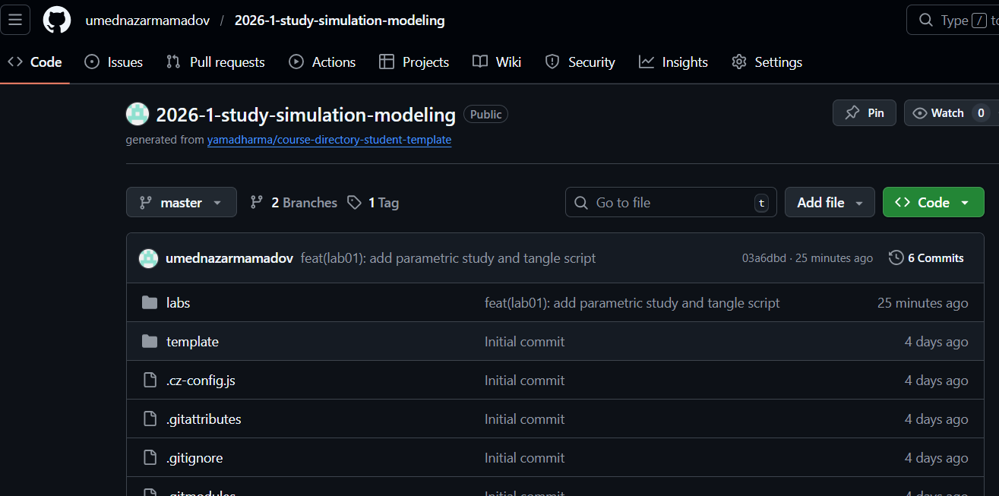
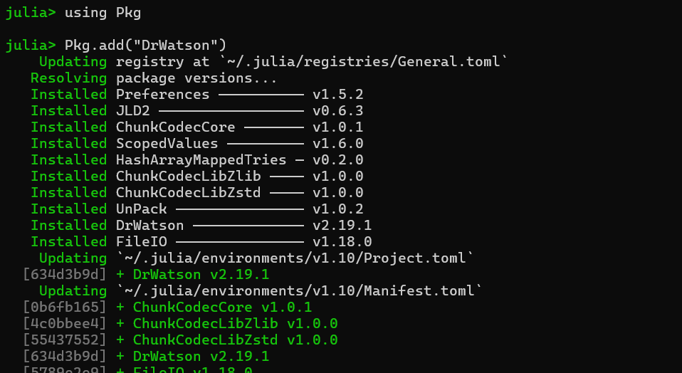
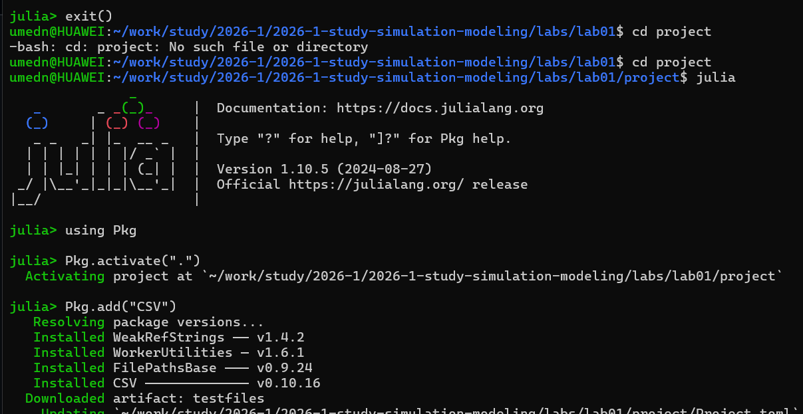
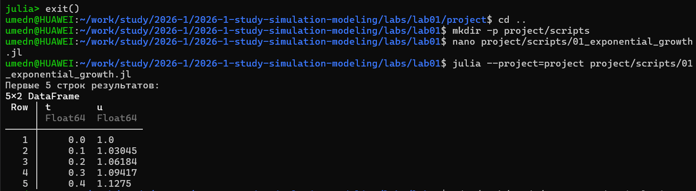
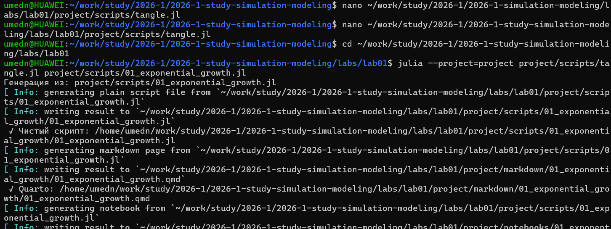
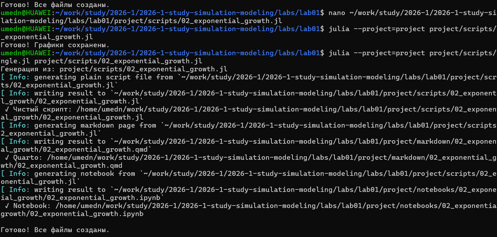
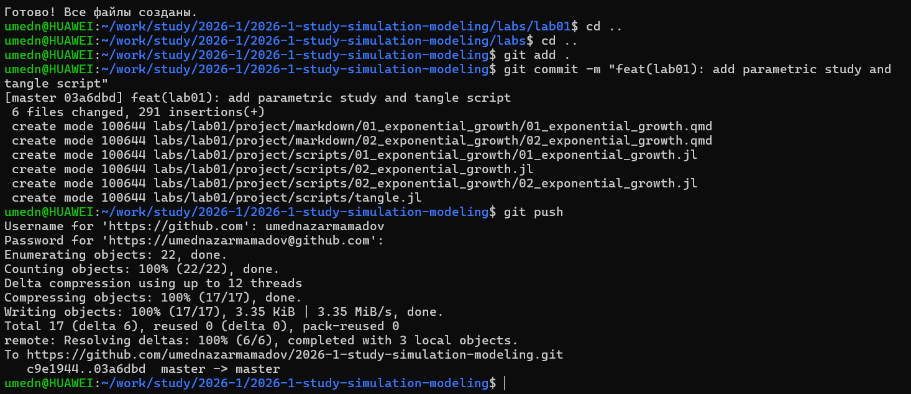

---
## Author
author:
  name: Назармамадов Умед Джамшедович
  email: 1032225205@rudn.ru
  affiliation:
    - name: Российский университет дружбы народов
      country: Российская Федерация
      postal-code: 117198
      city: Москва
      address: ул. Миклухо-Маклая, д. 6

## Title
title: "Отчёт по лабораторной работе №1"
subtitle: "Имитационное моделирование"
license: "CC BY"
---
# Цель работы

Целью лабораторной работы является подготовка рабочего стенда для
выполнения лабораторных работ по курсу имитационного моделирования.

В ходе работы необходимо:

-   настроить систему управления версиями Git;
-   создать репозиторий на GitHub;
-   настроить Git Flow;
-   установить язык программирования Julia и необходимые пакеты;
-   создать структуру проекта с использованием DrWatson;
-   проверить работоспособность среды на примере модели
    экспоненциального роста.

# Задание

В рамках лабораторной работы необходимо выполнить следующие действия:

1.  Настроить Git и Git Flow.
2.  Создать репозиторий проекта на GitHub.
3.  Организовать структуру рабочего пространства проекта.
4.  Установить язык программирования Julia.
5.  Создать проект с использованием пакета DrWatson.
6.  Реализовать и выполнить скрипт моделирования экспоненциального
    роста.
7.  Подготовить отчёт о выполненной работе.

# Теоретическое введение

Система управления версиями Git является распределённой системой
контроля версий, которая позволяет отслеживать изменения в исходном коде
и совместно работать над проектами.

GitHub представляет собой онлайн‑платформу для хранения репозиториев
Git, которая предоставляет инструменты для совместной разработки.

Методология Git Flow определяет стандартную модель ветвления,
используемую при разработке программного обеспечения. В рамках данной
модели используются следующие основные ветки:

-   **main** --- содержит стабильную версию проекта;
-   **develop** --- используется для разработки новых функций;
-   **feature** --- ветки для разработки отдельных функций;
-   **release** --- ветки подготовки релиза;
-   **hotfix** --- ветки для срочного исправления ошибок.

Для организации научных вычислительных проектов на языке Julia
используется пакет **DrWatson**, который обеспечивает воспроизводимость
экспериментов и удобную структуру каталогов проекта.

Стандартная структура проекта включает каталоги:

-   `src` --- исходный код
-   `scripts` --- исполняемые скрипты
-   `data` --- данные
-   `plots` --- графики
-   `docs` --- документация проекта

# Выполнение лабораторной работы

## Настройка Git и GitHub

На первом этапе была выполнена настройка системы управления версиями
Git. После этого был создан удалённый репозиторий проекта на платформе
GitHub.

Далее был инициализирован локальный репозиторий и выполнено подключение
к удалённому репозиторию ([рис. @fig-001]).

{#fig-001 width=70%}

## Настройка Git Flow

Для организации процесса разработки была настроена модель ветвления Git
Flow. После инициализации были созданы основные ветки проекта:

-   `main`
-   `develop`

Дальнейшая разработка ведётся в отдельных ветках `feature`.

## Установка Julia и необходимых пакетов ([рис. @fig-002]).

{#fig-001 width=70%}

Был установлен язык программирования Julia. После этого были подключены
необходимые библиотеки для выполнения лабораторных работ ([рис. @fig-003]).

{#fig-001 width=70%}

Для управления зависимостями используется встроенная система пакетов
Julia.

## Создание проекта DrWatson

Проект был инициализирован с использованием пакета DrWatson. Данный
пакет позволяет автоматически создать стандартную структуру проекта и
обеспечивает воспроизводимость вычислительных экспериментов ([рис. @fig-004]).

{#fig-001 width=70%}

После инициализации была сформирована структура каталогов проекта.

## Реализация модели экспоненциального роста

Для проверки работоспособности среды был создан скрипт моделирования
экспоненциального роста ([рис. @fig-005]).

{#fig-001 width=70%}

Модель экспоненциального роста описывается формулой:

x(t) = x0 \* e\^(rt)

где:

-   x0 --- начальное значение,
-   r --- коэффициент роста,
-   t --- время.

Пример реализации модели на языке Julia:

``` julia
using Plots

t = 0:0.1:10
x0 = 1.0
r = 0.3

x = x0 .* exp.(r .* t)

plot(t, x,
    xlabel="t",
    ylabel="x(t)",
    title="Экспоненциальный рост")
```

После выполнения скрипта был построен график экспоненциального роста.

## Работа со скриптами проекта

В проекте были созданы и запущены следующие скрипты ([рис. @fig-006]):

-   `01_exponential_growth.jl`
-   `02_exponential_growth.jl`

{#fig-001 width=70%}

Второй скрипт запускается с параметрами из командной строки.

Пример запуска ([рис. @fig-007]):

``` bash
julia --project scripts/02_exponential_growth.jl 1.0 0.3 10
```
{#fig-001 width=70%}

Все результаты работы проекта были сохранены в репозитории GitHub.

# Выводы

В ходе выполнения лабораторной работы была подготовлена рабочая среда
для выполнения последующих лабораторных работ по курсу имитационного
моделирования.

Были настроены система контроля версий Git и модель ветвления Git Flow,
создан репозиторий на GitHub, установлен язык программирования Julia и
необходимые библиотеки.

Также был создан проект с использованием DrWatson и реализована тестовая
модель экспоненциального роста, что подтвердило корректность настройки
среды и готовность системы к выполнению дальнейших лабораторных заданий.

# Список литературы {#список-литературы .unnumbered}

1.  Chacon S., Straub B. **Pro Git**. Apress.
2.  Tanenbaum A. **Modern Operating Systems**.
3.  Документация языка программирования Julia --- https://julialang.org
4.  Документация пакета DrWatson.jl ---
    https://juliadynamics.github.io/DrWatson.jl/
