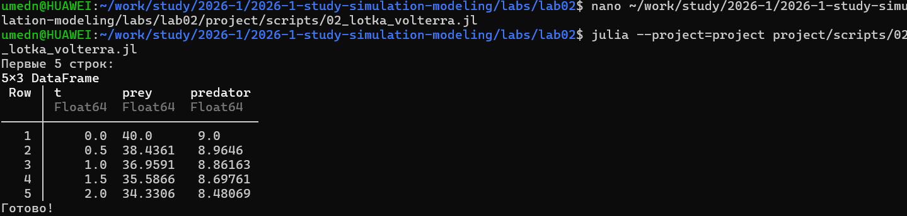

---
## Author
author:
  name: Назармамадов Умед Джамшедович
  email: 1032225205@rudn.ru
  affiliation:
    - name: Российский университет дружбы народов
      country: Российская Федерация
      postal-code: 117198
      city: Москва
      address: ул. Миклухо-Маклая, д. 6

## Title
title: "Лабораторная работа №2"
subtitle: "Основные модели: SIR и Лотки-Вольтерры"
license: "CC BY"
---

## Цель работы

- Изучить модель распространения инфекции SIR
- Изучить модель динамики хищник-жертва Лотки-Вольтерры
- Реализовать численное решение систем дифференциальных уравнений
- Построить графики динамики популяций

## Модель SIR

Популяция делится на три группы:

- **S** — восприимчивые (Susceptible)
- **I** — заражённые (Infectious)
- **R** — выздоровевшие (Recovered)

Система уравнений:

$$\frac{dS}{dt} = -\beta \frac{SI}{N}$$
$$\frac{dI}{dt} = \beta \frac{SI}{N} - \gamma I$$
$$\frac{dR}{dt} = \gamma I$$

## Параметры модели SIR

- N = 1000 (общая численность)
- I0 = 1 (начальное число заражённых)
- beta = 0.3 (коэффициент заражения)
- gamma = 0.1 (коэффициент выздоровления)
- R0 = beta/gamma = 3.0

## Результаты SIR

{width=70%}

Пик эпидемии наступает примерно на 30-й день, после чего число заражённых убывает по мере формирования коллективного иммунитета.

## Модель Лотки-Вольтерры

Взаимодействие хищников и жертв:

$$\frac{dx}{dt} = \alpha x - \beta xy$$
$$\frac{dy}{dt} = \delta xy - \gamma y$$

где x — жертвы, y — хищники.

## Параметры модели Лотки-Вольтерры

- x0 = 40 (начальная численность жертв)
- y0 = 9 (начальная численность хищников)
- alpha = 0.1, beta = 0.02
- gamma = 0.4, delta = 0.01

## Результаты Лотки-Вольтерры

{width=70%}

Наблюдаются характерные периодические колебания численности популяций — классический цикл хищник-жертва.

## Технический процесс

- Использован язык Julia и библиотека DifferentialEquations.jl
- Проект организован с помощью DrWatson
- Код преобразован в литературный стиль с помощью Literate.jl
- Сгенерированы чистый код, Quarto-документация и Jupyter Notebook

## Выводы

- Обе модели успешно реализованы и протестированы
- Модель SIR подтвердила теоретические предсказания о динамике эпидемии
- Модель Лотки-Вольтерры продемонстрировала классические колебания популяций
- Результаты оформлены в виде литературного программирования