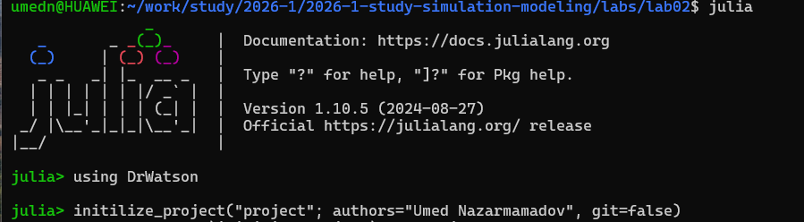
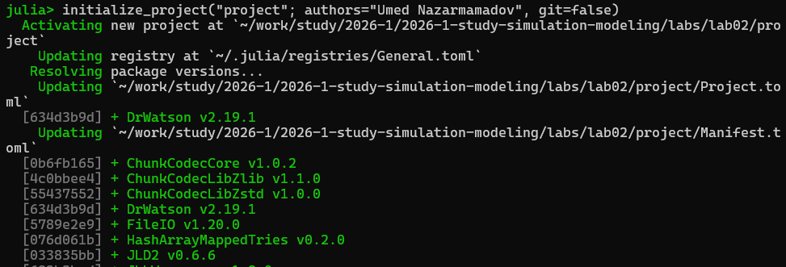
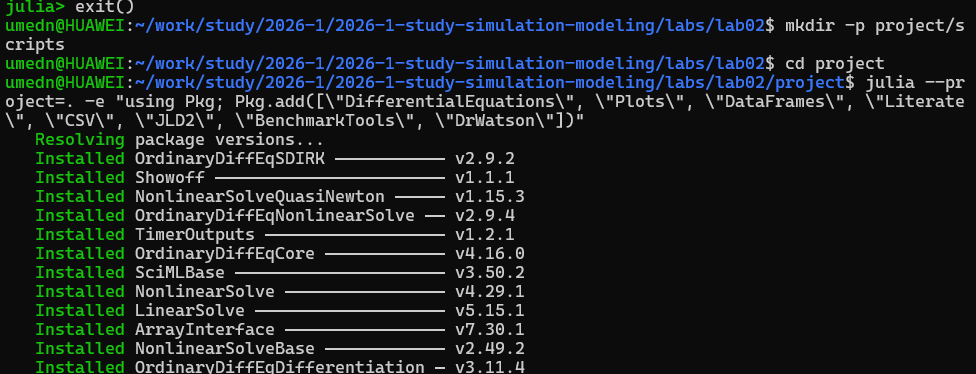

---
## Author
author:
  name: Назармамадов Умед Джамшедович
  email: 1032225205@rudn.ru
  affiliation:
    - name: Российский университет дружбы народов
      country: Российская Федерация
      postal-code: 117198
      city: Москва
      address: ул. Миклухо-Маклая, д. 6

## Title
title: "Лабораторная работа №2"
subtitle: "Основные модели: SIR и Лотки-Вольтерры"
license: "CC BY"
---

# Цель работы

Целью данной лабораторной работы является изучение и реализация двух классических математических моделей: модели распространения инфекции SIR и модели динамики популяций хищник-жертва Лотки-Вольтерры.

# Задание

1. Реализовать модель SIR для описания распространения инфекционного заболевания.
2. Реализовать модель Лотки-Вольтерры для описания динамики хищник-жертва.
3. Провести численное решение систем дифференциальных уравнений.
4. Построить графики динамики популяций.
5. Оформить результаты в виде литературного программирования.

# Теоретическое введение

Модель SIR делит популяцию на три группы: восприимчивые (S), заражённые (I) и выздоровевшие (R). Динамика описывается системой уравнений, где beta - коэффициент заражения, gamma - коэффициент выздоровления. Ключевой параметр R0 = beta/gamma показывает среднее число людей, которых заражает один больной.

Модель Лотки-Вольтерры описывает взаимодействие хищников и жертв. При росте жертв размножаются хищники, затем из-за нехватки пищи популяция хищников сокращается, и цикл повторяется.

# Выполнение лабораторной работы

## Подготовка окружения

Для реализации моделей был создан новый научный проект с использованием DrWatson.

{width=80%}

{width=80%}

{width=80%}

## Модель SIR

Модель SIR реализована в файле scripts/01_sir_model.jl с использованием библиотеки DifferentialEquations.jl. Система дифференциальных уравнений решается методом Tsit5().

Параметры модели:
- Общая численность популяции: N = 1000
- Начальное число заражённых: I0 = 1
- Начальное число восприимчивых: S0 = 999
- Коэффициент заражения: beta = 0.3
- Коэффициент выздоровления: gamma = 0.1
- Временной интервал: t = [0, 160] дней

Базовое репродуктивное число R0 = beta/gamma = 3.0, что означает, что один больной в среднем заражает троих. Это говорит об активном распространении инфекции в популяции.

В ходе моделирования наблюдается следующая динамика: в начале почти все находятся в группе S. Затем число заражённых I начинает быстро расти. Примерно на 30-й день достигается пик эпидемии. После пика число заражённых убывает, так как всё больше людей переходит в группу R. К концу моделирования эпидемия затухает - часть популяции так и не заразилась.

Результаты сохранены в виде таблицы DataFrame и файла JLD2.

{width=80%}

## Модель Лотки-Вольтерры

Модель реализована в файле scripts/02_lotka_volterra.jl. Система также решается методом Tsit5() из библиотеки DifferentialEquations.jl.

Параметры модели:
- Начальная численность жертв: x0 = 40
- Начальная численность хищников: y0 = 9
- Скорость роста жертв: alpha = 0.1
- Скорость выедания жертв хищниками: beta = 0.02
- Скорость гибели хищников: gamma = 0.4
- Эффективность питания хищников: delta = 0.01
- Временной интервал: t = [0, 200]

В ходе моделирования наблюдаются характерные периодические колебания. Сначала при малом числе хищников популяция жертв растёт. Затем хищники получают достаточно пищи и начинают размножаться. Рост числа хищников приводит к сокращению жертв. После этого из-за нехватки пищи сокращается и популяция хищников. Цикл повторяется снова. Система никогда не приходит в равновесие - колебания продолжаются на протяжении всего временного интервала.

Результаты сохранены в виде таблицы DataFrame и файла JLD2.

{width=80%}

## Генерация производных форматов

Для обоих скриптов с помощью tangle.jl были сгенерированы три формата:

- Чистый исполняемый код Julia без комментариев
- Документация в формате Quarto (.qmd) для включения в отчёт
- Jupyter Notebook (.ipynb) для интерактивного выполнения

# Выводы

В ходе работы успешно реализованы модели SIR и Лотки-Вольтерры. Модель SIR подтвердила теоретические предсказания о динамике эпидемии и пороге коллективного иммунитета. Модель Лотки-Вольтерры продемонстрировала характерные периодические колебания численности хищников и жертв. Результаты оформлены в виде литературного программирования с использованием пакета Literate.jl.

# Список литературы{.unnumbered}

::: {#refs}
:::