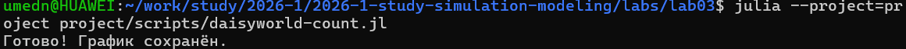

---
## Author
author:
  name: Назармамадов Умед Джамшедович
  email: 1032225205@rudn.ru
  affiliation:
    - name: Российский университет дружбы народов
      country: Российская Федерация
      postal-code: 117198
      city: Москва
      address: ул. Миклухо-Маклая, д. 6

## Title
title: "Лабораторная работа №3"
subtitle: "Агентное моделирование: модель Daisyworld"
license: CC BY
date: today
date-format: 2026-09-02
---

# Информация

## Докладчик

:::::::::::::: {.columns align=center}
::: {.column width="70%"}

  * Назармамадов Умед Джамшедович
  * Российский университет дружбы народов им. П. Лумумбы
  * [1032225205@rudn.ru]
  * <https://umednazarmamadov.github.io/ru/>

:::
::: {.column width="30%"}


:::
::::::::::::::

# Вводная часть

## Цель работы

- Изучить агентный подход к имитационному моделированию (ABM)
- Реализовать модель Daisyworld на языке Julia
- Исследовать механизм саморегуляции температуры планеты

## Агентный подход

Ключевые компоненты агентной модели:

- **Агенты** — активные сущности со свойствами и правилами поведения
- **Среда** — пространство, в котором существуют агенты
- **Взаимодействия** — правила влияния агентов друг на друга и на среду

Глобальное поведение системы возникает из локальных взаимодействий (эмерджентность).

## Модель Daisyworld

Иллюстрирует гипотезу Геи: планета как саморегулирующаяся система.

- Чёрные маргаритки — поглощают тепло, нагревают среду
- Белые маргаритки — отражают свет, охлаждают среду
- Размножение возможно только в определённом диапазоне температур

## Реализация модели

- Агент: маргаритка (вид, возраст, альбедо)
- Среда: клеточная сетка 30x30 с периодическими границами
- Библиотека: Agents.jl
- Визуализация: CairoMakie

## Базовая визуализация

{width=70%}

Тепловая карта температуры поверхности на разных шагах моделирования.

## Динамика числа маргариток

{width=70%}

Колебания численности чёрных и белых маргариток с последующей стабилизацией.

## Комплексная динамика

{width=70%}

Реакция системы на изменение солнечной светимости (сценарий :ramp).

## Механизм саморегуляции

- При росте светимости солнца меняется соотношение чёрных и белых маргариток
- Система стабилизирует температуру поверхности планеты
- При сильном внешнем воздействии саморегуляция нарушается

## Параметрическое исследование

- Варьировались параметры: max_age (25, 40) и init_white (0.2, 0.8)
- Использована функция dict_list из DrWatson
- Проведены все три сценария для каждой комбинации параметров

## Литературное программирование

- Все скрипты преобразованы через Literate.jl
- Сгенерированы: чистый код, Quarto-документация, Jupyter Notebook
- Notebooks выполнены и проверены

## Выводы

- Модель Daisyworld успешно реализована на Julia
- Подтверждён механизм саморегуляции (гипотеза Геи)
- Проведено параметрическое исследование влияния ключевых параметров
- Результаты оформлены в виде литературного программирования


---
## Author
author:
  name: Назармамадов Умед Джамшедович
  email: 1032225205@rudn.ru
  affiliation:
    - name: Российский университет дружбы народов
      country: Российская Федерация
      postal-code: 117198
      city: Москва
      address: ул. Миклухо-Маклая, д. 6

## Title
title: "Лабораторная работа №3"
subtitle: "Агентное моделирование: модель Daisyworld"
license: CC BY
date: today
date-format: 2026-09-02
---

# Информация

## Докладчик

:::::::::::::: {.columns align=center}
::: {.column width="70%"}

  * Кулябов Дмитрий Сергеевич
  * д.ф.-м.н., профессор
  * профессор кафедры теории вероятностей и кибербезопасности
  * Российский университет дружбы народов им. П. Лумумбы
  * [kulyabov-ds@rudn.ru](mailto:kulyabov-ds@rudn.ru)
  * <https://yamadharma.github.io/ru/>

:::
::: {.column width="30%"}


:::
::::::::::::::

# Вводная часть

## Актуальность

- Важно донести результаты своих исследований до окружающих
- Научная презентация --- рабочий инструмент исследователя
- Необходимо создавать презентацию быстро
- Желательна минимизация усилий для создания презентации

## Объект и предмет исследования

- Презентация как текст
- Программное обеспечение для создания презентаций
- Входные и выходные форматы презентаций

## Цели и задачи

- Создать шаблон презентации в Markdown
- Описать алгоритм создания выходных форматов презентаций

## Материалы и методы

- Процессор `pandoc` для входного формата Markdown
- Результирующие форматы
 - `pdf`
 - `html`
- Автоматизация процесса создания: `Makefile`

# Создание презентации

## Процессор `pandoc`

- Pandoc: преобразователь текстовых файлов
- Сайт: <https://pandoc.org/>
- Репозиторий: <https://github.com/jgm/pandoc>

## Формат `pdf`

- Использование LaTeX
- Пакет для презентации: [beamer](https://ctan.org/pkg/beamer)
- Тема оформления: `metropolis`

## Код для формата `pdf`

```yaml
slide_level: 2
aspectratio: 169
section-titles: true
theme: metropolis
```

## Формат `html`

- Используется фреймворк [reveal.js](https://revealjs.com/)
- Используется [тема](https://revealjs.com/themes/) `beige`

## Код для формата `html`

- Тема задаётся в файле `Makefile`

```make
REVEALJS_THEME = beige
```
# Результаты

## Получающиеся форматы

- Полученный `pdf`-файл можно демонстрировать в любой программе просмотра `pdf`
- Полученный `html`-файл содержит в себе все ресурсы: изображения, css, скрипты

# Элементы презентации

## Актуальность

- Даёт понять, о чём пойдёт речь
- Следует широко и кратко описать проблему
- Мотивировать свое исследование
- Сформулировать цели и задачи
- Возможна формулировка ожидаемых результатов

## Цели и задачи

- Не формулируйте более 1--2 целей исследования

## Материалы и методы

- Представляйте данные качественно
- Количественно, только если крайне необходимо
- Излишние детали не нужны

## Содержание исследования

- Предлагаемое решение задач исследования с обоснованием
- Основные этапы работы

## Результаты

- Не нужны все результаты
- Необходимы логические связки между слайдами
- Необходимо показать понимание материала

## Итоговый слайд

- Запоминается последняя фраза. © Штирлиц
- Главное сообщение, которое вы хотите донести до слушателей
- Избегайте использовать последний слайд вида *Спасибо за внимание*

# Рекомендую

## Принцип 10/20/30

  - 10 слайдов
  - 20 минут на доклад
  - 30 кегль шрифта

## Связь слайдов

::: incremental

- Один слайд --- одна мысль
- Нельзя ссылаться на объекты, находящиеся на предыдущих слайдах (например, на формулы)
- Каждый слайд должен иметь заголовок

:::

## Количество сущностей

::: incremental

- Человек может одновременно помнить $7 \pm 2$ элемента
- При размещении информации на слайде старайтесь чтобы в сумме слайд содержал не более 5 элементов
- Можно группировать элементы так, чтобы визуально было не более 5 групп

:::

## Общие рекомендации

::: incremental

- На слайд выносится та информация, которая без зрительной опоры воспринимается хуже
- Слайды должны дополнять или обобщать содержание выступления или его частей, а не дублировать его
- Информация на слайдах должна быть изложена