---
## Author
author:
  name: Назармамадов Умед Джамшедович
  email: 1032225205@rudn.ru
  affiliation:
    - name: Российский университет дружбы народов
      country: Российская Федерация
      postal-code: 117198
      city: Москва
      address: ул. Миклухо-Маклая, д. 6

## Title
title: "Лабораторная работа №3"
subtitle: "Агентное моделирование: модель Daisyworld"
license: "CC BY"
---

# Цель работы

Целью данной лабораторной работы является изучение агентного подхода к имитационному моделированию (Agent-Based Modeling) и реализация классической модели Daisyworld, иллюстрирующей гипотезу Геи.

# Задание

1. Создать рабочий каталог для кода и установить необходимые пакеты.
2. Реализовать модель Daisyworld на языке Julia с использованием пакета Agents.jl.
3. Выполнить базовую визуализацию модели.
4. Построить анимацию эволюции модели.
5. Построить график динамики числа маргариток.
6. Построить комплексный график динамики модели (число маргариток, температура, светимость).
7. Преобразовать код в литературный стиль и сгенерировать чистый код, Jupyter Notebook и документацию в формате Quarto.
8. Выполнить код из Jupyter Notebook.
9. Повторить все пункты для набора параметров модели.
10. Интегрировать документацию в формате Quarto в отчёт.

# Теоретическое введение

Агентный подход к имитационному моделированию (ABM) - это метод исследования сложных систем, в котором поведение системы возникает из взаимодействия множества автономных сущностей - агентов. Ключевыми компонентами агентной модели являются агенты, среда и правила их взаимодействия.

Модель Daisyworld, предложенная Джеймсом Лавлоком и Эндрю Уотсоном, иллюстрирует гипотезу Геи - планета рассматривается как единая саморегулирующаяся система. В мире маргариток произрастают чёрные и белые маргаритки с разным альбедо: чёрные поглощают тепло и нагревают среду, белые - отражают свет и охлаждают её. Маргаритки размножаются только в определённом температурном диапазоне, что создаёт механизм саморегуляции температуры планеты за счёт изменения соотношения чёрных и белых маргариток.

# Выполнение лабораторной работы

## Подготовка окружения

Для реализации модели был установлен язык Julia и необходимые пакеты: Agents.jl (для агентного моделирования), CairoMakie (для визуализации), StatsBase, DataFrames и DrWatson.

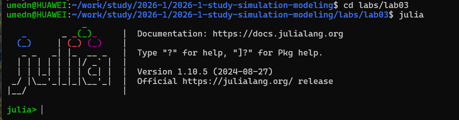{width=80%}

## Реализация модели

Модель Daisyworld реализована в файле src/daisyworld.jl. Агентами являются маргаритки (тип Daisy) со свойствами: вид (чёрная/белая), возраст и альбедо. Среда представлена двумерной клеточной сеткой 30x30 с периодическими границами. На каждом шаге моделирования для каждой клетки пересчитывается локальная температура с учётом альбедо занимающей её маргаритки (или поверхности, если клетка пуста), происходит диффузия температуры между соседними клетками, а также возможно размножение маргариток на пустые соседние клетки в зависимости от локальной температуры.

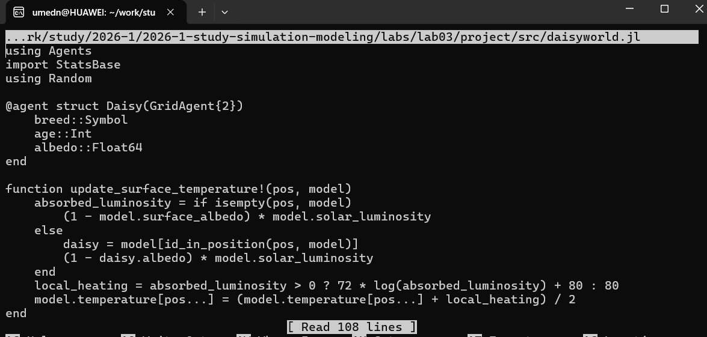{width=80%}

## Базовая визуализация

Для запуска модели и построения базовой визуализации создан файл scripts/daisyworld.jl. Скрипт строит тепловую карту температуры поверхности модели, на которой чёрные и белые маргаритки отображаются соответствующими маркерами, на трёх стадиях моделирования (начальная, 5 и 40 шагов).

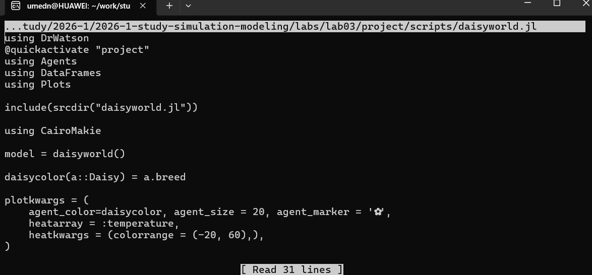{width=80%}

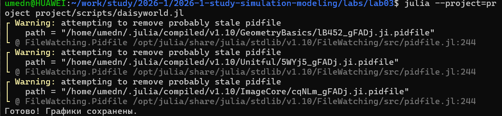{width=80%}

Результаты показывают, что изначально случайно распределённые маргаритки формируют устойчивое пространственное распределение, при этом температура поверхности стабилизируется за счёт баланса чёрных и белых маргариток.

## Анимация модели

Для наглядной демонстрации эволюции модели во времени создан файл scripts/daisyworld-animate.jl, генерирующий видеофайл с анимацией.

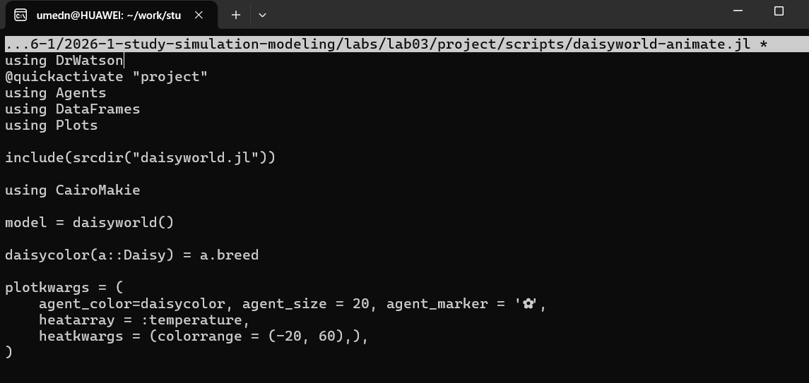{width=80%}

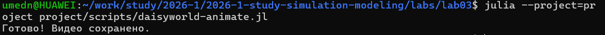{width=80%}

## Динамика числа маргариток

Для анализа изменения численности чёрных и белых маргариток во времени создан файл scripts/daisyworld-count.jl, строящий соответствующий график.

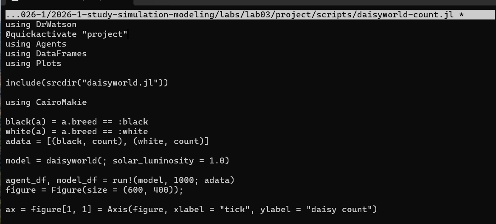{width=80%}

{width=80%}

График показывает колебания численности обоих видов маргариток на начальном этапе моделирования с последующей стабилизацией вокруг равновесных значений.

## Комплексная динамика модели

Для исследования взаимосвязи числа маргариток, температуры поверхности и солнечной светимости создан файл scripts/daisyworld-luminosity.jl. В этом сценарии (:ramp) солнечная светимость постепенно увеличивается, а затем уменьшается, что позволяет наблюдать реакцию системы маргариток на внешнее возмущение.

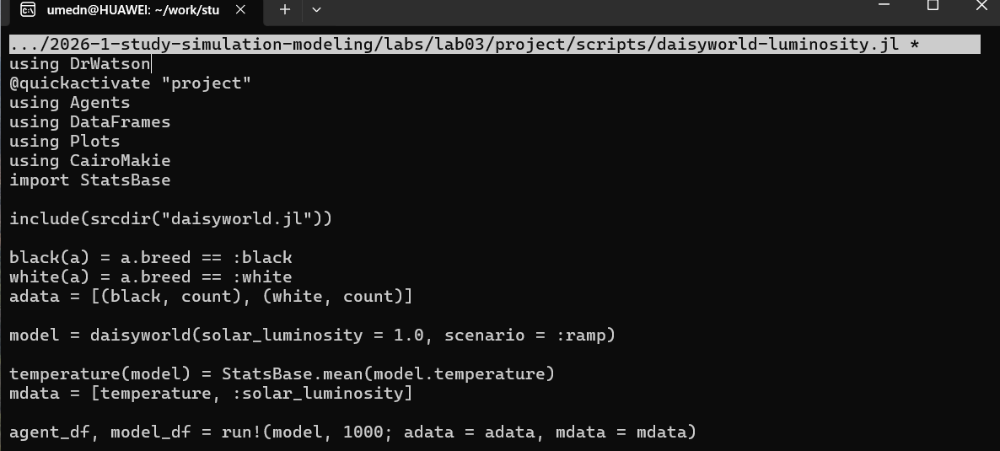{width=80%}

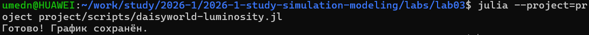{width=80%}

Результаты демонстрируют механизм саморегуляции: при росте светимости солнца соотношение чёрных и белых маргариток меняется таким образом, чтобы стабилизировать температуру поверхности планеты в допустимом диапазоне, что подтверждает гипотезу Геи. При достаточно сильном внешнем воздействии способность системы к саморегуляции нарушается.

## Параметрическое исследование

Для изучения влияния параметров модели (максимальный возраст маргаритки max_age и начальная доля белых маргариток init_white) все три сценария были повторены для набора комбинаций параметров с использованием функции dict_list из DrWatson.

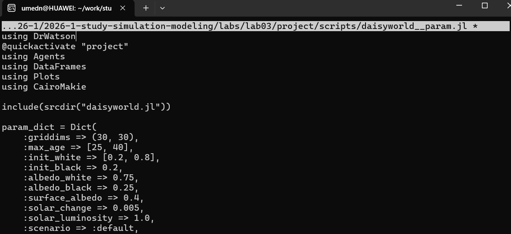{width=80%}

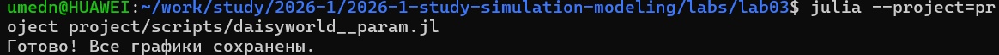{width=80%}

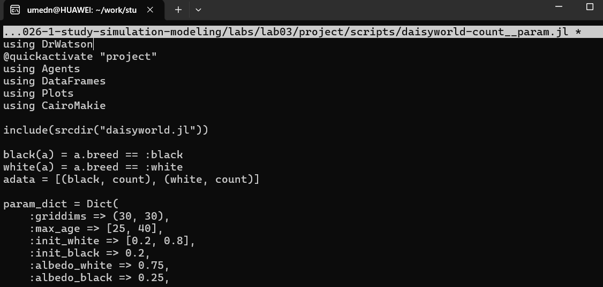{width=80%}

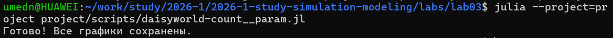{width=80%}

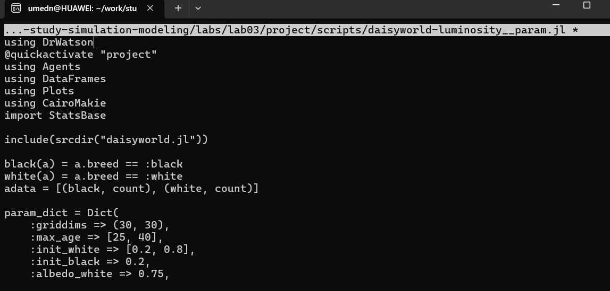{width=80%}

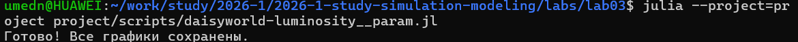{width=80%}

Результаты параметрического исследования показывают, что при увеличении максимального возраста маргаритки система стабилизируется медленнее, а начальная доля белых маргариток влияет на начальную температуру поверхности и скорость установления равновесия.

## Генерация производных форматов

Для преобразования всех семи скриптов в литературный стиль использован вспомогательный скрипт tangle.jl, основанный на библиотеке Literate.jl. Для каждого скрипта были сгенерированы чистый исполняемый код, документация в формате Quarto и Jupyter Notebook, который затем был выполнен.

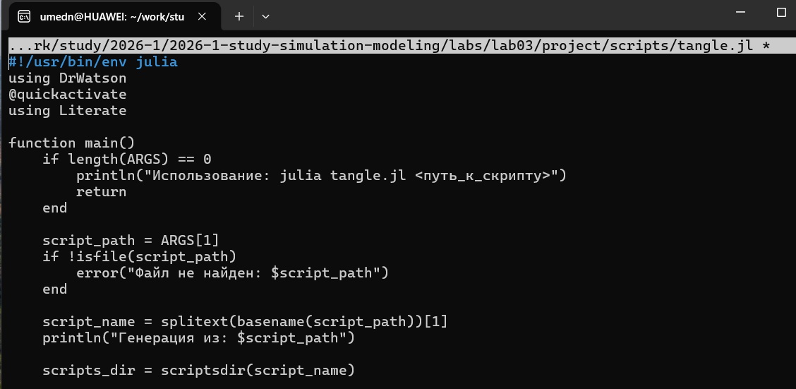{width=80%}

# Выводы

В ходе лабораторной работы изучен агентный подход к имитационному моделированию и реализована классическая модель Daisyworld на языке Julia с использованием пакета Agents.jl. Построены базовая визуализация, анимация, графики динамики численности маргариток и комплексной динамики модели, а также проведено параметрическое исследование влияния ключевых параметров модели. Результаты подтвердили механизм саморегуляции температуры планеты за счёт взаимодействия живых организмов со средой, иллюстрирующий гипотезу Геи. Весь код преобразован в литературный стиль с генерацией нескольких производных форматов.

# Список литературы{.unnumbered}

::: {#refs}
:::.png