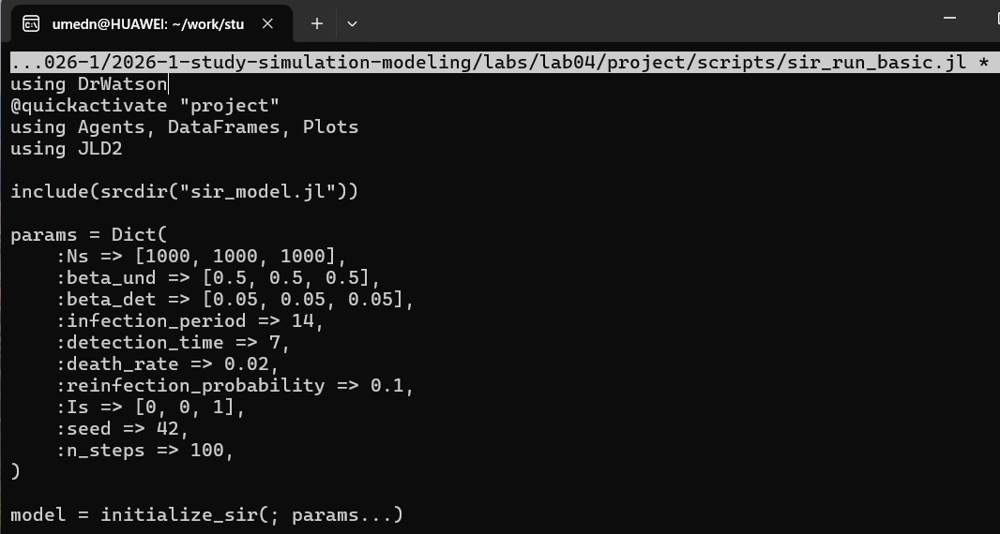
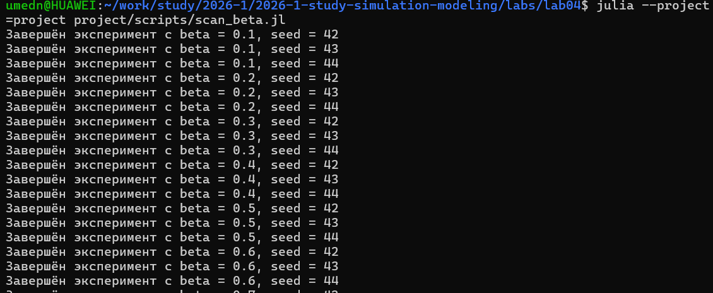
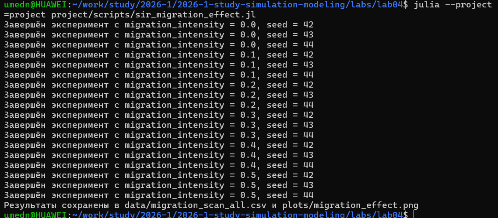

---
## Author
author:
  name: Назармамадов Умед Джамшедович
  email: 1032225205@rudn.ru
  affiliation:
    - name: Российский университет дружбы народов
      country: Российская Федерация
      postal-code: 117198
      city: Москва
      address: ул. Миклухо-Маклая, д. 6

## Title
title: "Лабораторная работа №4"
subtitle: "Агентная эпидемиологическая модель SIR на графе городов"
license: CC BY
date: today
date-format: 2026-09-02
---

# Информация

## Докладчик

:::::::::::::: {.columns align=center}
::: {.column width="70%"}

  * Назармамадов Умед Джамшедович
  * Российский университет дружбы народов им. П. Лумумбы
  * [1032225205@rudn.ru]
  * <https://umednazarmamadov.github.io/ru/>

:::
::: {.column width="30%"}

## Цель работы

- Реализовать агентную модель SIR на графе городов
- Учесть миграцию населения между городами
- Исследовать влияние параметров на динамику эпидемии
- Провести многокритериальную оптимизацию

## Агентная модель vs классическая SIR

- Классическая SIR — система дифференциальных уравнений
- Агентная модель — каждый человек отдельный агент
- Учитывается пространственная структура (граф городов)
- Возможна миграция и локальные вспышки

## Реализация модели

- Агент: статус (S/I/R), дни с момента заражения
- Города — вершины полного графа
- Миграция по заданной матрице вероятностей
- Заразность зависит от времени выявления инфекции

## Базовый эксперимент

{width=60%}

Классическая картина развития эпидемии: рост, пик, спад числа инфицированных.

## Сканирование параметра beta

{width=60%}

Нелинейный рост пиковой заболеваемости и смертности с увеличением заразности.

## Эффект миграции

{width=60%}

Рост интенсивности миграции — более ранний и высокий пик эпидемии.

## Многокритериальная оптимизация

- Алгоритм Borg MOEA (BlackBoxOptim)
- Критерии: пиковая заболеваемость и доля умерших
- Параметры: beta, время выявления, смертность
- Результат — Парето-фронт компромиссных решений

## Результаты оптимизации

{width=70%}

Раннее выявление снижает пик, но не всегда влияет на смертность напрямую.

## Литературное программирование

- Все скрипты преобразованы через 'Literate.jl'
- Сгенерированы: чистый код, Quarto-документация, Jupyter Notebook
- Notebooks выполнены и проверены

## Выводы

- Агентная модель SIR успешно реализована на графе городов
- Показана нелинейная зависимость эпидемии от заразности
- Миграция значимо ускоряет и усиливает эпидемию
- Найдены компромиссные стратегии управления эпидемией