---
## Author
author:
  name: Назармамадов Умед Джамшедович
  email: 1032225205@rudn.ru
  affiliation:
    - name: Российский университет дружбы народов
      country: Российская Федерация
      postal-code: 117198
      city: Москва
      address: ул. Миклухо-Маклая, д. 6

## Title
title: "Лабораторная работа №4"
subtitle: "Агентная эпидемиологическая модель SIR на графе городов"
license: "CC BY"
---

# Цель работы

Целью данной лабораторной работы является реализация агентной эпидемиологической модели SIR на графе городов с учётом миграции населения, исследование влияния параметров модели на динамику эпидемии и проведение многокритериальной оптимизации параметров управления эпидемией.

# Задание

1. Создать рабочий каталог для кода и установить необходимые пакеты.
2. Реализовать агентную модель SIR на графе городов с миграцией населения.
3. Провести базовый эксперимент и построить график динамики эпидемии.
4. Провести сканирование параметра заразности beta и построить график зависимости показателей эпидемии от beta.
5. Исследовать влияние интенсивности миграции населения между городами на время и величину пика эпидемии.
6. Провести многокритериальную оптимизацию параметров (заразность, время выявления, смертность) с использованием эволюционного алгоритма Borg MOEA.
7. Построить сводную визуализацию результатов.
8. Преобразовать код в литературный стиль и сгенерировать чистый код, документацию Quarto и Jupyter Notebook.
9. Выполнить код из Jupyter Notebook.

# Теоретическое введение

В отличие от классической модели SIR, описываемой системой дифференциальных уравнений, агентная реализация модели SIR рассматривает каждого человека как отдельного агента с индивидуальным статусом (восприимчив, инфицирован, выздоровел). Агенты размещены на графе городов и могут мигрировать между ними согласно заданной матрице миграции. Внутри города инфицированный агент может заразить восприимчивых соседей с вероятностью, зависящей от того, выявлена ли у него инфекция (после detection_time дней заразность снижается за счёт изоляции). Выздоровевшие агенты могут повторно заразиться с некоторой вероятностью reinfection_probability, а инфицированные агенты могут погибнуть с вероятностью death_rate по истечении периода болезни infection_period.

Такой подход позволяет исследовать пространственную динамику эпидемии и эффект перемещения населения между регионами, что невозможно в рамках классической детерминированной модели.

# Выполнение лабораторной работы

## Подготовка окружения

Для реализации модели был установлен язык Julia и необходимые пакеты: Agents.jl (агентное моделирование на графах), BlackBoxOptim (эволюционная оптимизация), Distributions, StatsBase, DataFrames, CSV, JLD2 и DrWatson.

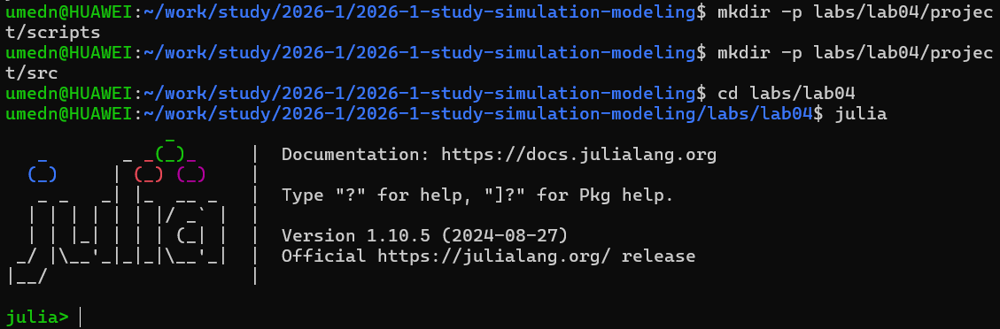{width=80%}

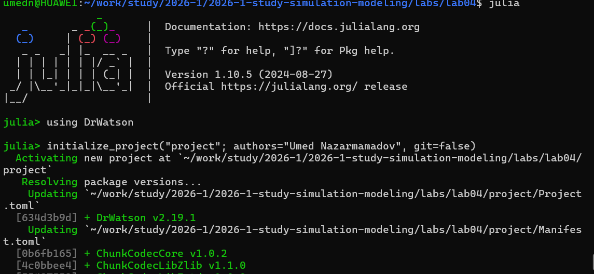{width=80%}

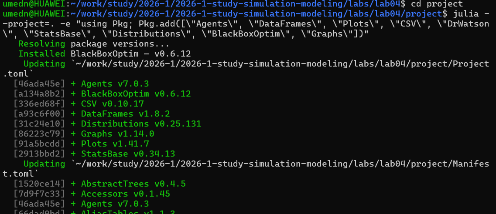{width=80%}

## Реализация модели

Модель реализована в файле src/sir_model.jl. Агент представляет собой человека со статусом (:S, :I или :R) и числом дней с момента заражения. Города представлены вершинами полного графа, между которыми агенты мигрируют согласно матрице миграции. На каждом шаге агент сначала может мигрировать в другой город, затем, если он инфицирован, может заразить случайных соседей в текущем городе, после чего проверяется его выздоровление или смерть по истечении периода болезни.

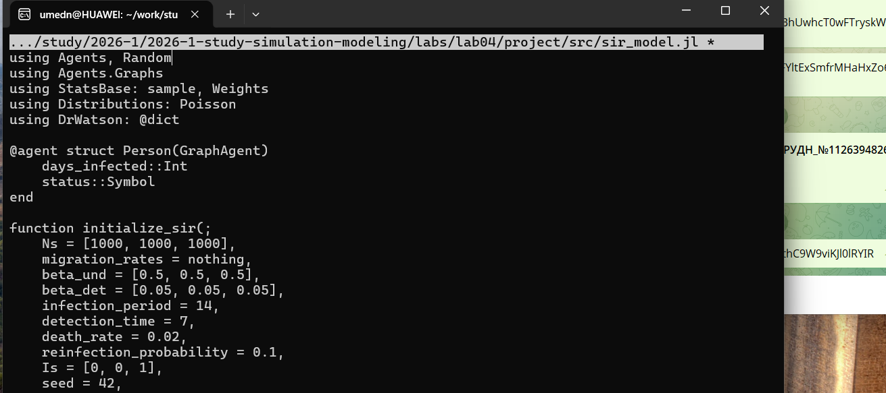{width=80%}

## Базовый эксперимент

Для запуска базового эксперимента с тремя городами создан файл scripts/sir_run_basic.jl. Модель инициализируется с одним инфицированным агентом в третьем городе, после чего строится график динамики численности восприимчивых, инфицированных и выздоровевших агентов на протяжении 100 дней.

{width=80%}

Результаты показывают классическую картину развития эпидемии: рост числа инфицированных с последующим пиком и постепенным снижением по мере перехода агентов в группу выздоровевших.

## Сканирование параметра заразности

Для исследования влияния коэффициента заразности beta на характеристики эпидемии создан файл scripts/scan_beta.jl. Проведена серия экспериментов для значений beta от 0.1 до 1.0 с

емя повторами для каждого значения (разные seed), усреднены пиковая и конечная доля инфицированных, а также число умерших.

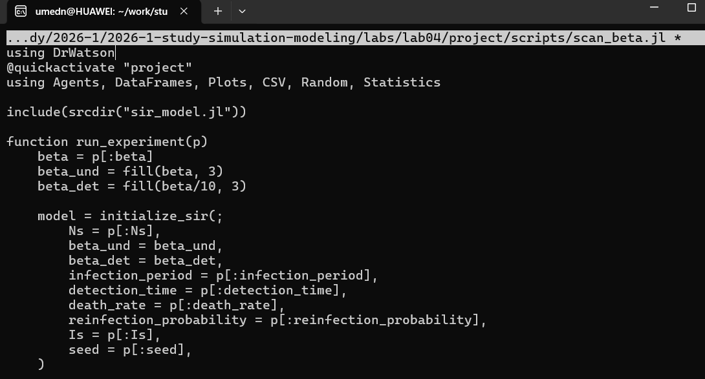{width=80%}

{width=80%}

Результаты демонстрируют нелинейный рост пиковой заболеваемости и смертности с увеличением заразности, а также наличие порогового значения beta, ниже которого эпидемия практически не развивается.

## Исследование эффекта миграции

Для оценки влияния интенсивности миграции населения между городами на динамику эпидемии создан файл scripts/sir_migration_effect.jl. Матрица миграции строится с заданной интенсивностью, при этом инфекция стартует только в одном городе. Проведено сканирование интенсивности миграции от 0 до 0.5 с тремя повторами.

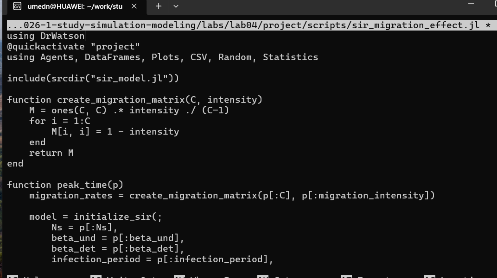{width=80%}

{width=80%}

Результаты показывают, что увеличение интенсивности миграции приводит к более раннему и более высокому пику эпидемии, поскольку инфекция быстрее распространяется по всем городам вместо того, чтобы оставаться локализованной.

## Многокритериальная оптимизация параметров

Для поиска компромиссных стратегий управления эпидемией создан файл scripts/sir_optimize_parameters.jl. С помощью эволюционного алгоритма Borg MOEA из пакета BlackBoxOptim одновременно минимизировались два критерия — пиковая заболеваемость и доля умерших — при варьировании заразности beta, времени выявления инфекции и смертности.

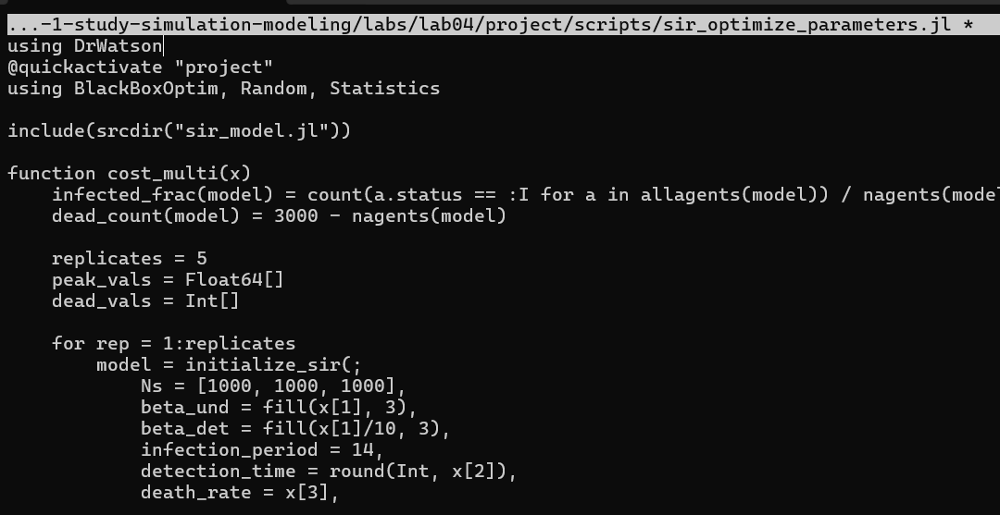{width=80%}

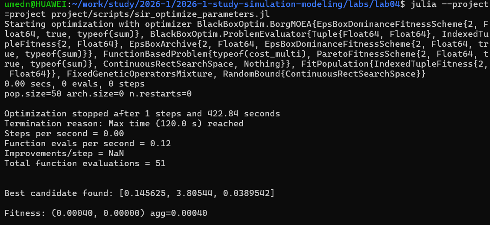{width=80%}

Результатом оптимизации является набор точек на Парето-фронте, представляющих компромиссные стратегии: например, более раннее выявление инфекции снижает пик заболеваемости, но не всегда напрямую влияет на итоговую смертность.

## Сводная визуализация результатов

Для итогового обобщения результатов сканирования параметра beta создан файл scripts/sir_visualize_dynamics.jl, строящий составной график из трёх панелей: пиковая и конечная доля инфицированных, число умерших и доля выздоровевших в зависимости от beta.

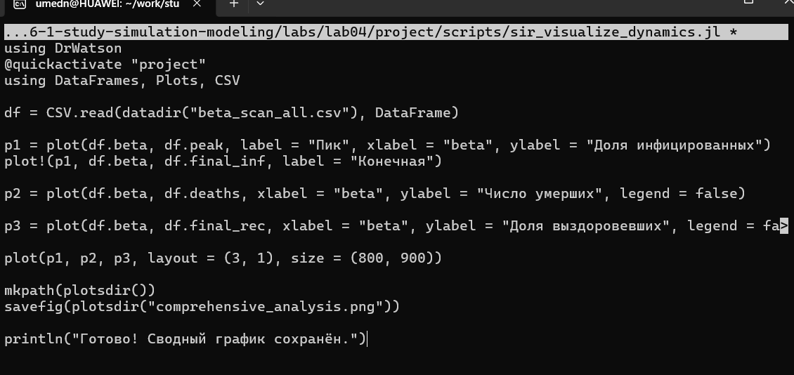{width=80%}

## Генерация производных форматов

Для преобразования всех пяти скриптов в литературный стиль использован вспомогательный скрипт tangle.jl на основе библиотеки Literate.jl. Для каждого скрипта сгенерированы чистый исполняемый код, документация в формате Quarto и Jupyter Notebook.

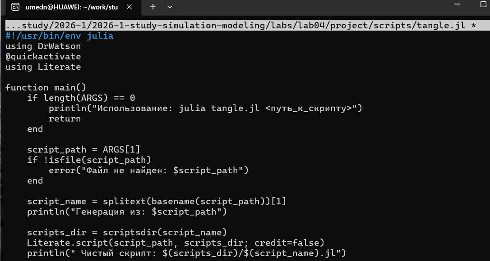{width=80%}

Все сгенерированные Jupyter Notebook были выполнены для проверки корректности литературного представления кода.

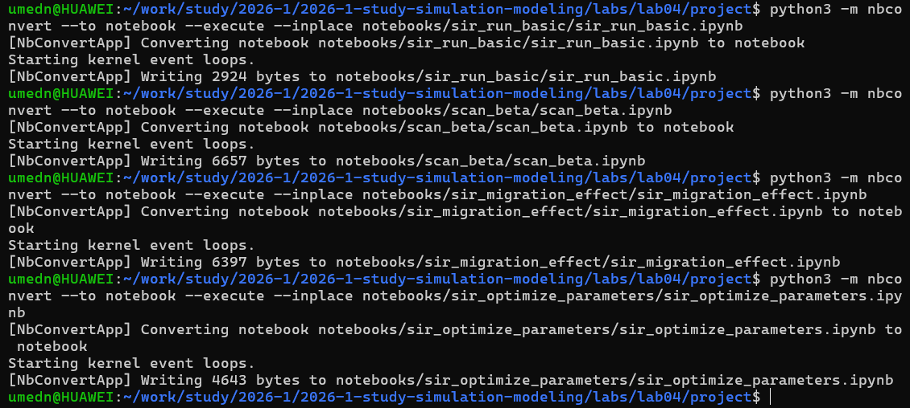{width=80%}

# Выводы

В ходе лабораторной работы реализована агентная эпидемиологическая модель SIR на графе городов с учётом миграции населения. Проведённые эксперименты показали нелинейную зависимость характеристик эпидемии от коэффициента заразности, а также значимое влияние интенсивности миграции на скорость и масштаб распространения инфекции. Многокритериальная оптимизация с использованием алгоритма Borg MOEA позволила найти компромиссные стратегии управления эпидемией, минимизирующие одновременно пиковую заболеваемость и смертность. Весь код преобразован в литературный стиль с генерацией нескольких производных форматов.

# Список литературы{.unnumbered}

::: {#refs}
::: тр