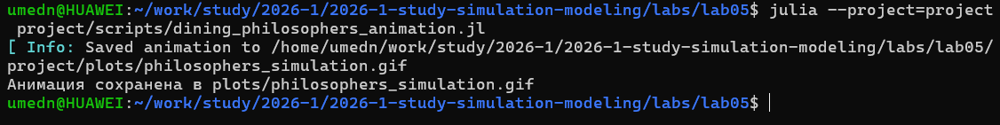

---
## Author
author:
  name: Назармамадов Умед Джамшедович
  email: 1032225205@rudn.ru
  affiliation:
    - name: Российский университет дружбы народов
      country: Российская Федерация
      postal-code: 117198
      city: Москва
      address: ул. Миклухо-Маклая, д. 6

## Title
title: "Лабораторная работа №5"
subtitle: "Аппарат сетей Петри: задача обедающих философов"
license: "CC BY"
---

## Цель работы

- Изучить аппарат сетей Петри
- Реализовать задачу "Обедающие философы"
- Исследовать проблему взаимной блокировки (deadlock)
- Изучить способ предотвращения тупика через арбитра

## Сети Петри

- Позиции (места) — хранят фишки, описывают состояния
- Переходы — активные элементы, описывают события
- Дуги — связи между позициями и переходами
- Маркировка — текущее распределение фишек

Переход разрешён, если во входных позициях достаточно фишек.

## Задача обедающих философов

- N философов за круглым столом
- Между соседями лежит одна вилка
- Для еды нужны обе соседние вилки
- Сформулирована Дейкстрой в 1965 году

## Проблема deadlock

При наивной реализации:

- Каждый философ сначала берёт левую вилку
- Если все возьмут левую одновременно
- Все будут бесконечно ждать правую
- Система замирает — взаимная блокировка

## Решение через арбитра

- Дополнительная позиция с N-1 фишками
- Ограничивает число философов, одновременно берущих вилки
- Теоретически никогда не заходит в deadlock

## Реализация модели

- Структура PetriNet с матрицей инцидентности
- build_classical_network — сеть без синхронизации
- build_arbiter_network — сеть с арбитром
- Стохастическое моделирование методом Гиллеспи

## Базовые эксперименты

{width=60%}

N=5 философов, tmax=50. Классическая сеть vs сеть с арбитром.

## Результаты: классическая сеть

- Все философы переходят в состояние "Голоден"
- Ни один не может поесть
- detect_deadlock возвращает true

## Результаты: сеть с арбитром

- Постоянное чередование приёма пищи
- Отсутствие длительных блокировок
- detect_deadlock возвращает false

## Анимация процесса

{width=60%}

Наглядная демонстрация изменения маркировки во времени.

## Итоговый сравнительный график

- Классическая сеть: линии "Ест" падают до нуля и остаются там
- Сеть с арбитром: линии продолжают колебаться
- Количественное подтверждение эффективности арбитра

## Литературное программирование

- Все скрипты преобразованы через Literate.jl
- Сгенерированы: чистый код, Quarto-документация, Jupyter Notebook
- Notebooks выполнены и проверены

## Выводы

- Реализована классическая задача синхронизации
- Подтверждена неизбежность deadlock без синхронизации
- Арбитр полностью предотвращает взаимную блокировку
- Результаты наглядно продемонстрированы графиками и анимацией