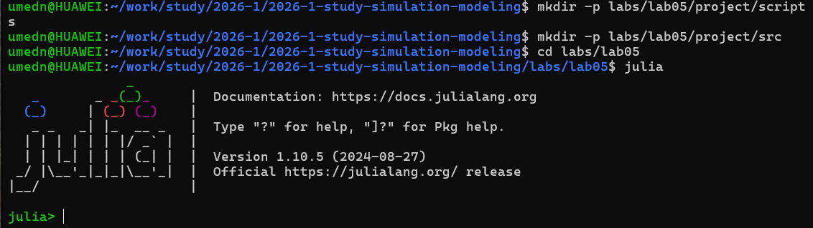
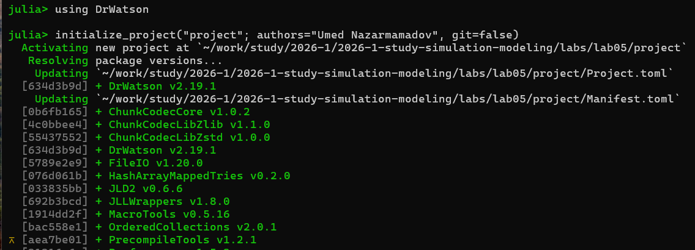
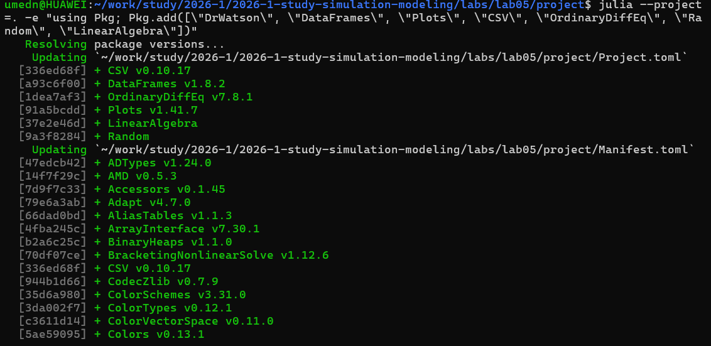
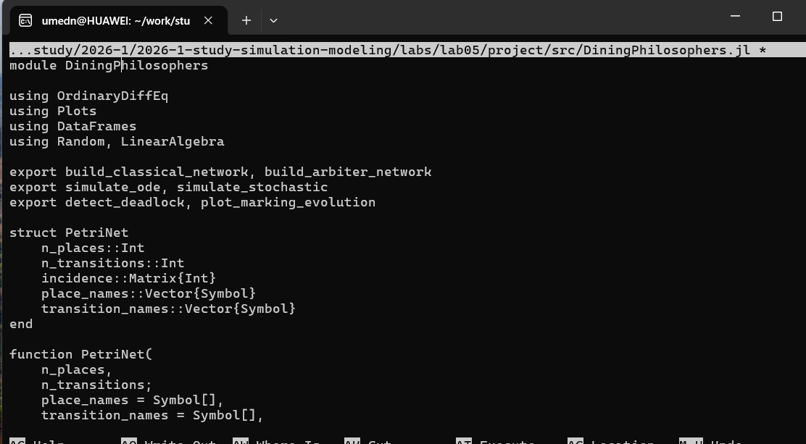
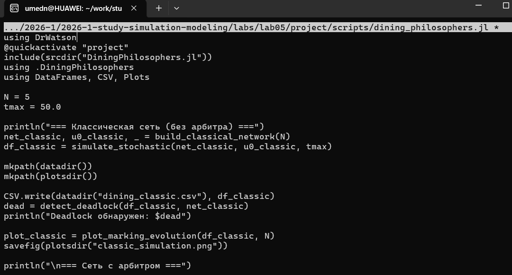
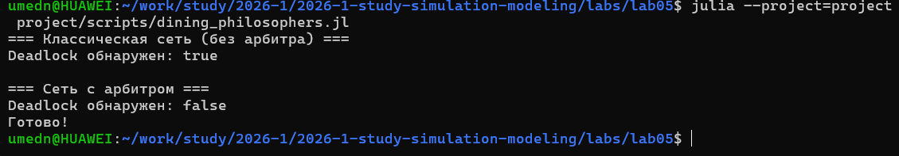
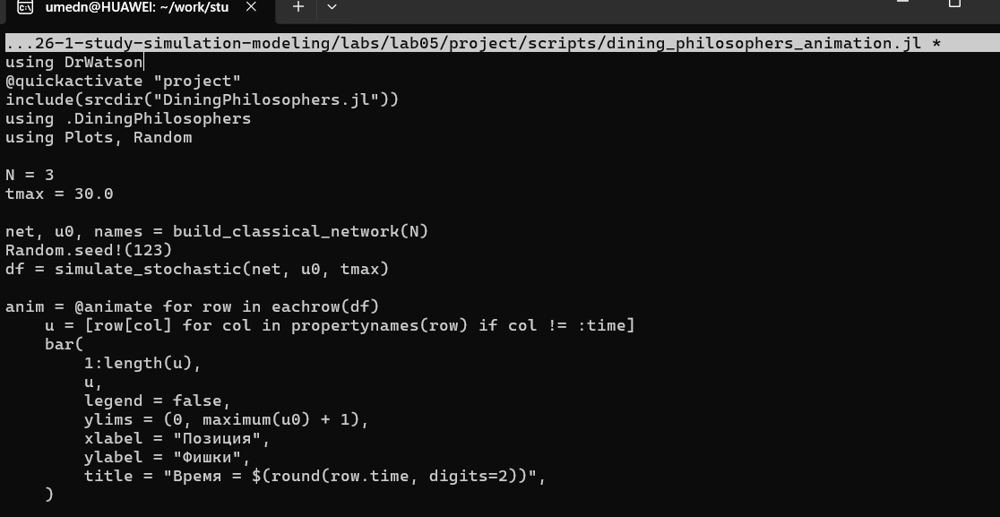
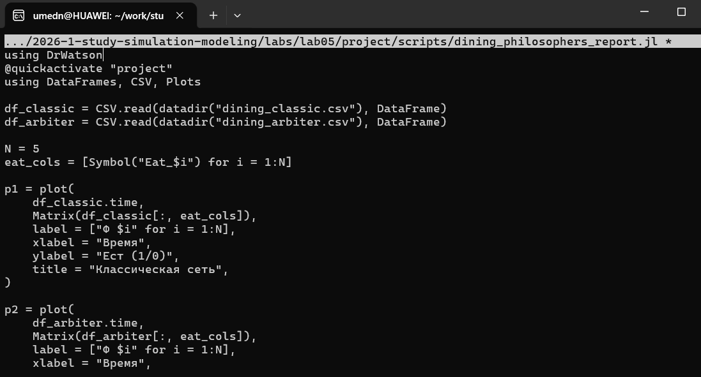
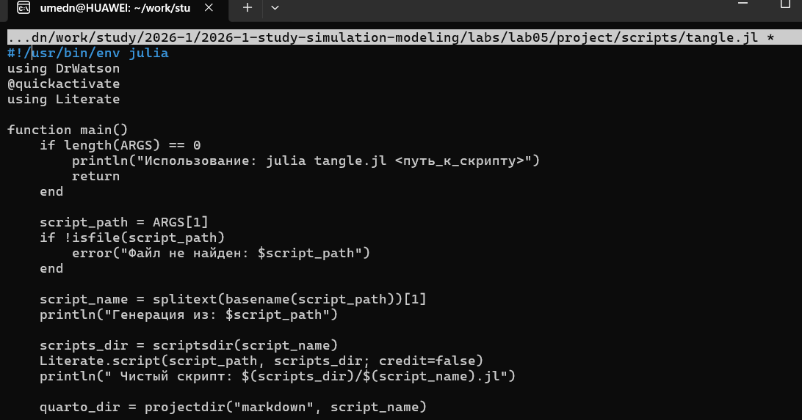
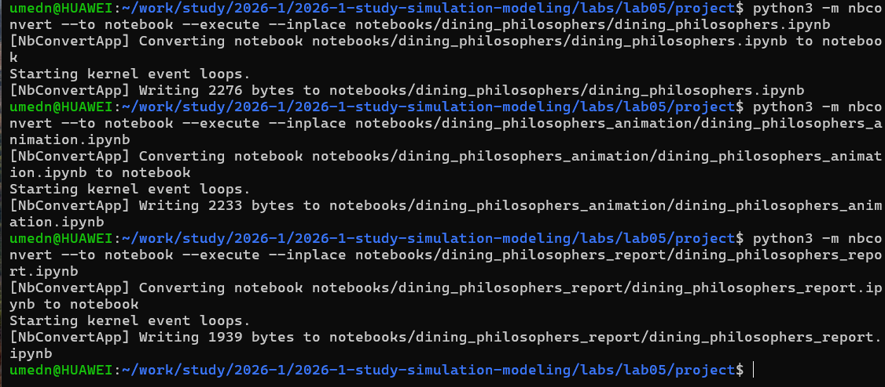

---
## Author
author:
  name: Назармамадов Умед Джамшедович
  email: 1032225205@rudn.ru
  affiliation:
    - name: Российский университет дружбы народов
      country: Российская Федерация
      postal-code: 117198
      city: Москва
      address: ул. Миклухо-Маклая, д. 6

## Title
title: "Лабораторная работа №5"
subtitle: "Аппарат сетей Петри: задача обедающих философов"
license: "CC BY"
---

# Цель работы

Целью данной лабораторной работы является изучение аппарата сетей Петри и его применение для моделирования классической задачи синхронизации "Обедающие философы", включая исследование проблемы взаимной блокировки (deadlock) и способов её предотвращения.

# Задание

1. Создать рабочий каталог для кода и установить необходимые пакеты.
2. Реализовать модуль сетей Петри с построением классической сети (без арбитра) и сети с арбитром.
3. Провести стохастическое моделирование (алгоритм Гиллеспи) для обеих сетей и определить наличие deadlock.
4. Построить анимацию динамики маркировки сети.
5. Построить сводный сравнительный график состояний "Ест" для обеих моделей.
6. Преобразовать код в литературный стиль и сгенерировать чистый код, документацию Quarto и Jupyter Notebook.
7. Выполнить код из Jupyter Notebook.

# Теоретическое введение

Сеть Петри — математический аппарат для моделирования дискретных систем, представляемый как двудольный ориентированный граф с двумя типами вершин: позиции (места) и переходы. Дуги соединяют позиции с переходами и наоборот, а маркировка (распределение фишек по позициям) описывает текущее состояние системы. Переход считается разрешённым, если каждая его входная позиция содержит достаточное для срабатывания количество фишек; срабатывание перехода удаляет фишки из входных позиций и добавляет их в выходные.

Задача "Обедающие философы", сформулированная Эдсгером Дейкстрой в 1965 году, иллюстрирует проблему взаимной блокировки (deadlock) при конкурентном доступе к разделяемым ресурсам. N философов сидят за круглым столом, между каждой парой соседей лежит одна вилка, и философу для еды нужны обе соседние вилки. При наивной реализации, когда каждый философ сначала берёт левую вилку, а затем правую, возможна ситуация, когда все философы одновременно возьмут левую вилку и будут бесконечно ждать правую — это и есть deadlock. Один из способов предотвращения тупика — введение арбитра, ограничивающего число философов, одновременно претендующих на вилки, до N-1.

# Выполнение лабораторной работы

## Подготовка окружения

Для реализации модели был установлен язык Julia и необходимые пакеты: OrdinaryDiffEq, DataFrames, CSV, Plots и DrWatson.

{width=80%}

{width=80%}

{width=80%}

## Реализация модели

Модель сети Петри реализована в модуле src/DiningPhilosophers.jl. Определена структура PetriNet с матрицей инцидентности, задающей входные и выходные дуги переходов. Функция build_classical_network строит классическую сеть для N философов без синхронизации, а build_arbiter_network добавляет дополнительную позицию-арбитр с N-1 фишками, ограничивающую число философов, одновременно берущих вилки. Реализованы детерминированное моделирование на основе ОДУ и стохастическое моделирование прямым методом Гиллеспи, а также функция detect_deadlock для проверки, остались ли в системе разрешённые переходы.

{width=80%}

## Базовые эксперименты

Для сравнения классической сети и сети с арбитром создан файл scripts/dining_philosophers.jl. Для N=5 философов проведена стохастическая симуляция на время tmax=50 для обеих сетей, результаты сохранены в CSV и проверены на наличие deadlock.

{width=80%}

{width=80%}

Результаты подтвердили теоретические предсказания: в классической сети без синхронизации возникает взаимная блокировка — все философы переходят в состояние "Голоден" и остаются в нём навсегда, в то время как сеть с арбитром демонстрирует постоянное чередование приёма пищи без блокировок.

## Анимация процесса

Для наглядной

ии динамики работы сети Петри во времени создан файл scripts/dining_philosophers_animation.jl, генерирующий GIF-анимацию изменения маркировки для классической сети с N=3 философами.

{width=80%}

{width=80%}

Анимация наглядно показывает перемещение фишек между позициями "Думает", "Голоден", "Ест" и "Вилка", а также застывание маркировки на последних кадрах, соответствующее наступлению deadlock.

## Итоговый сравнительный отчёт

Для количественного сравнения двух моделей создан файл scripts/dining_philosophers_report.jl, загружающий ранее сохранённые CSV-файлы и строящий сводный график динамики состояний "Ест" для каждого философа в обеих сетях.

{width=80%}

На графике для классической сети все линии состояния "Ест" со временем падают до нуля и остаются на нём — деятельность философов полностью прекращается. Для сети с арбитром линии продолжают колебаться на протяжении всего времени моделирования, что подтверждает эффективность арбитра как механизма предотвращения тупиков.

## Генерация производных форматов

Для преобразования всех трёх скриптов в литературный стиль использован вспомогательный скрипт tangle.jl на основе библиотеки Literate.jl. Для каждого скрипта сгенерированы чистый исполняемый код, документация в формате Quarto и Jupyter Notebook.

{width=80%}

Все сгенерированные Jupyter Notebook были выполнены для проверки корректности литературного представления кода.

{width=80%}

# Выводы

В ходе лабораторной работы изучен аппарат сетей Петри и реализована классическая задача синхронизации "Обедающие философы". Проведённое стохастическое моделирование подтвердило теоретический вывод о неизбежности взаимной блокировки при наивной реализации без синхронизации, в то время как введение арбитра, ограничивающего число одновременно голодных философов, полностью предотвращает deadlock. Построенные анимация и сводный сравнительный график наглядно продемонстрировали различие в поведении обеих моделей. Весь код преобразован в литературный стиль с генерацией нескольких производных форматов.

# Список литературы{.unnumbered}

::: {#refs}
::: демонстрац