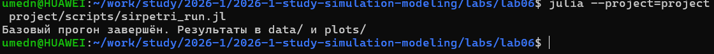
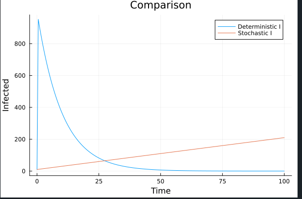
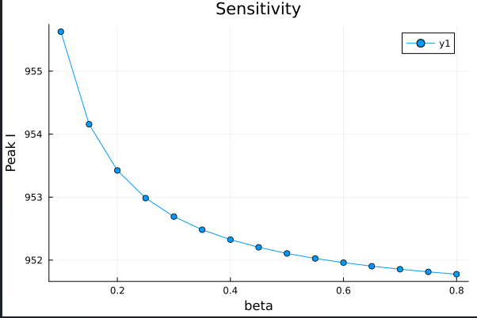

---
## Author
author:
  name: Назармамадов Умед Джамшедович
  email: 1032225205@rudn.ru
  affiliation:
    - name: Российский университет дружбы народов
      country: Российская Федерация
      postal-code: 117198
      city: Москва
      address: ул. Миклухо-Маклая, д. 6

## Title
title: "Лабораторная работа №6"
subtitle: "Реализация модели SIR в подходе сетей Петри"
license: "CC BY"
---

## Цель работы

- Реализовать модель SIR в формализме сетей Петри
- Провести детерминированную и стохастическую симуляции
- Исследовать чувствительность модели к параметру заразности
- Построить анимацию и сравнительный отчёт

## Модель SIR как сеть Петри

- Позиции: S, I, R
- Переход infection: S + I -> I + I (скорость beta*S*I)
- Переход recovery: I -> R (скорость gamma*I)
- Начальная маркировка: S=990, I=10, R=0

## Два подхода к моделированию

**Детерминированный**

- Система ОДУ на основе закона действующих масс
- Решение методом Tsit5
- Плавная усреднённая динамика

**Стохастический**

- Прямой метод Гиллеспи (SSA)
- Случайные дискретные события
- Учитывает флуктуации

## Базовый прогон

{width=60%}

beta=0.3, gamma=0.1, tmax=100. Сравнение детерминированной и стохастической динамики.

## Сканирование параметра beta

{width=60%}

Пороговое явление: при малых beta эпидемия не развивается, выше порога — быстрый рост пика заболеваемости.

## Анимация динамики

{width=60%}

Столбчатая диаграмма численности S, I, R в каждый момент времени.

## Итоговое сравнение

{width=70%}

Детерминированная и стохастическая динамика I(t) близки при большой популяции.

## Чувствительность к beta

{width=70%}

Количественная зависимость пика заболеваемости от коэффициента заразности.

## Литературное программирование

- Все скрипты преобразованы через Literate.jl
- Сгенерированы: чистый код, Quarto-документация, Jupyter Notebook
- Notebooks выполнены и проверены

## Выводы

- Модель SIR успешно реализована в формализме сетей Петри
- Подтверждено пороговое явление по параметру заразности
- Детерминированная и стохастическая динамика близки при большой популяции
- Результаты наглядно продемонстрированы графиками и анимацией