---
## Author
author:
  name: Назармамадов Умед Джамшедович
  email: 1032225205@rudn.ru
  affiliation:
    - name: Российский университет дружбы народов
      country: Российская Федерация
      postal-code: 117198
      city: Москва
      address: ул. Миклухо-Маклая, д. 6

## Title
title: "Лабораторная работа №6"
subtitle: "Реализация модели SIR в подходе сетей Петри"
license: "CC BY"
---

# Цель работы

Целью данной лабораторной работы является реализация классической эпидемиологической модели SIR в формализме сетей Петри с использованием детерминированного (на основе ОДУ) и стохастического (алгоритм Гиллеспи) подходов к моделированию, а также исследование чувствительности модели к параметру заразности.

# Задание

1. Создать рабочий каталог для кода и установить необходимые пакеты.
2. Реализовать модель SIR в формализме сетей Петри с переходами infection (S+I -> I+I) и recovery (I -> R).
3. Провести детерминированную и стохастическую симуляции и построить графики динамики.
4. Провести сканирование параметра заразности beta и построить график зависимости пика заболеваемости и итогового числа выздоровевших от beta.
5. Построить анимацию динамики численности групп S, I, R.
6. Построить итоговый сравнительный отчёт (детерминированная vs стохастическая динамика, чувствительность к beta).
7. Преобразовать код в литературный стиль и сгенерировать чистый код, документацию Quarto и Jupyter Notebook.
8. Выполнить код из Jupyter Notebook.

# Теоретическое введение

Модель SIR может быть представлена в формализме сетей Петри, где состояния S, I, R являются позициями сети, а переходы между ними описывают события эпидемиологического процесса. Переход infection моделирует заражение: S + I -> I + I со скоростью, пропорциональной beta*S*I (закон действующих масс). Переход recovery моделирует выздоровление: I -> R со скоростью gamma*I.

На основе такой сети возможны два типа симуляции. Детерминированная симуляция строит систему обыкновенных дифференциальных уравнений на основе закона действующих масс и решает её численно, давая плавную усреднённую динамику. Стохастическая симуляция использует прямой метод алгоритма Гиллеспи (Stochastic Simulation Algorithm), моделируя дискретные случайные события заражения и выздоровления с учётом их интенсивностей, что позволяет учесть случайные флуктуации, особенно значимые при малой численности популяции.

# Выполнение лабораторной работы

## Подготовка окружения

Для реализации модели был установлен язык Julia и необходимые пакеты: OrdinaryDiffEq, DataFrames, CSV, Plots и DrWatson.

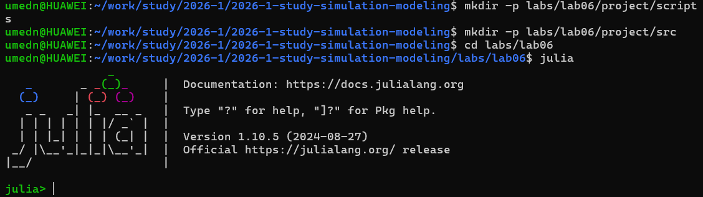{width=80%}

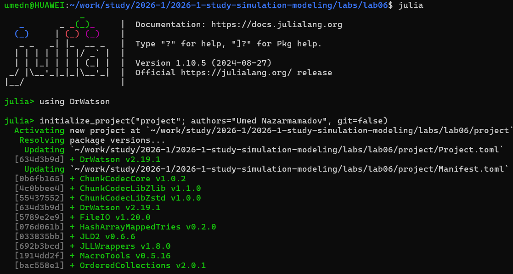{width=80%}

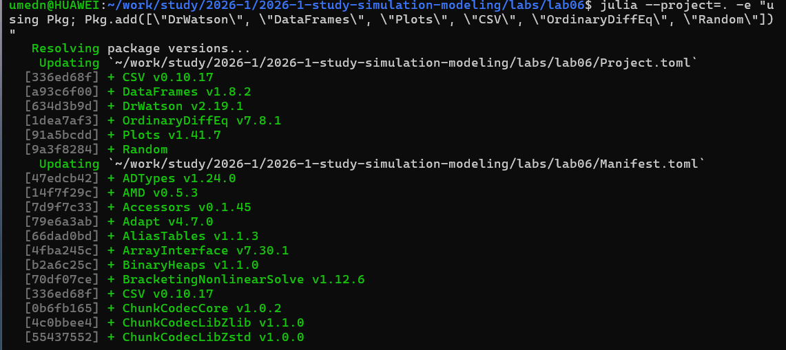{width=80%}

## Реализация модели

Модель реализована в модуле src/SIRPetri.jl. Функция build_sir_network создаёт сеть с параметрами beta и gamma и задаёт начальную маркировку S=990, I=10, R=0. Функция simulate_deterministic строит и решает систему ОДУ методом Tsit5, а simulate_stochastic реализует прямой метод Гиллеспи, на каждом шаге вычисляя интенсивности событий заражения и выздоровления и разыгрывая время и тип следующего события.

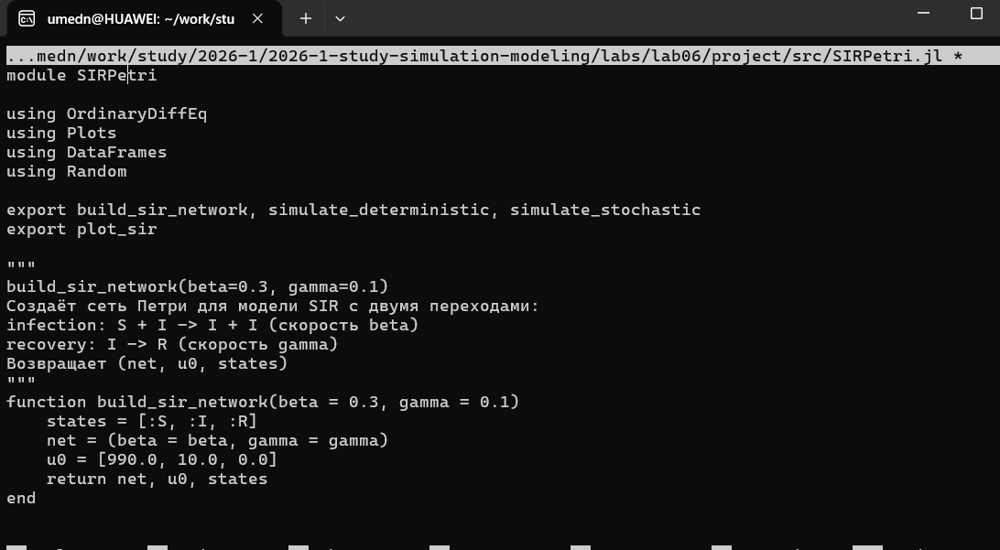{width=80%}

## Базовый прогон модели

Для сравнения детерминированной и стохастической динамики создан файл scripts/sirpetri_run.jl. Модель запускается с параметрами beta=0.3, gamma=0.1 на время tmax=100.

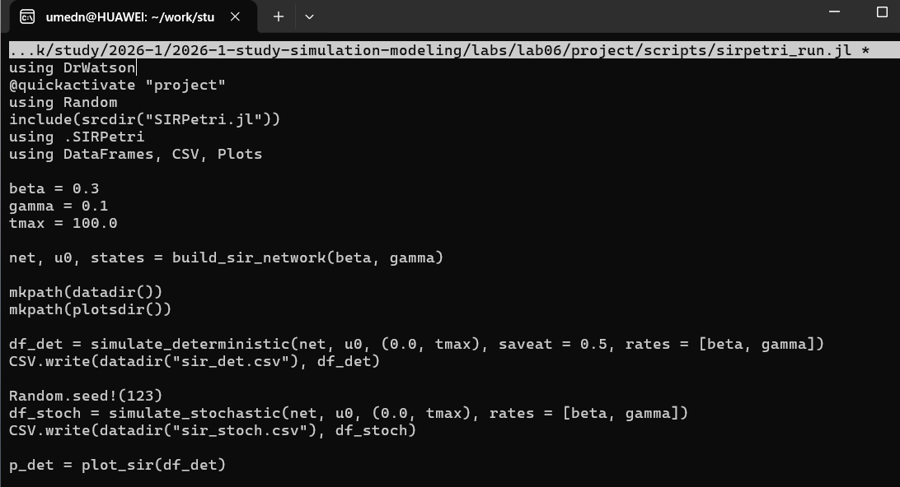{width=80%}

{width=80%}

Детерминированный график демонстрирует классическую картину эпидемии: рост числа инфицированных до пика с последующим спадом до нуля, при этом восприимчивые убывают, а выздоровевшие монотонно растут до плато. Стохастическая траектория близка к детерминированной за счёт большого начального числа восприимчивых (990), однако содержит характерный шум, вызванный случайностью отдельных событий.

## Сканирование параметра заразности

Для исследования чувствительности модели к коэффициенту заразности beta создан файл scripts/sirpetri_scan_parameters.jl. Проведена серия детерминированных симуляций для значений beta от 0.1 до 0.8 с шагом 0.05 при фиксированном gamma=0.1.

{width=80%}

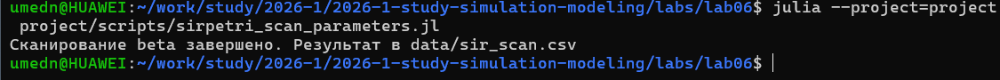{width=80%}

Результаты демонстрируют пороговое явление, характерное для модели SIR: при малых значениях beta эпидемия практически не развивается (пик инфицированных и итоговое число выздоровевших близки к нулю), однако при превышении некоторого критического значения beta пик заболеваемости резко возрастает и выходит на насыщение, когда практически всё население переболевает.

## Анимация динамики

Для наглядной демонстрации изменения численности групп S, I, R во времени создан файл scripts/sirpetri_animate.jl, строящий анимированную столбчатую диаграмму на основе детерминированной симуляции.

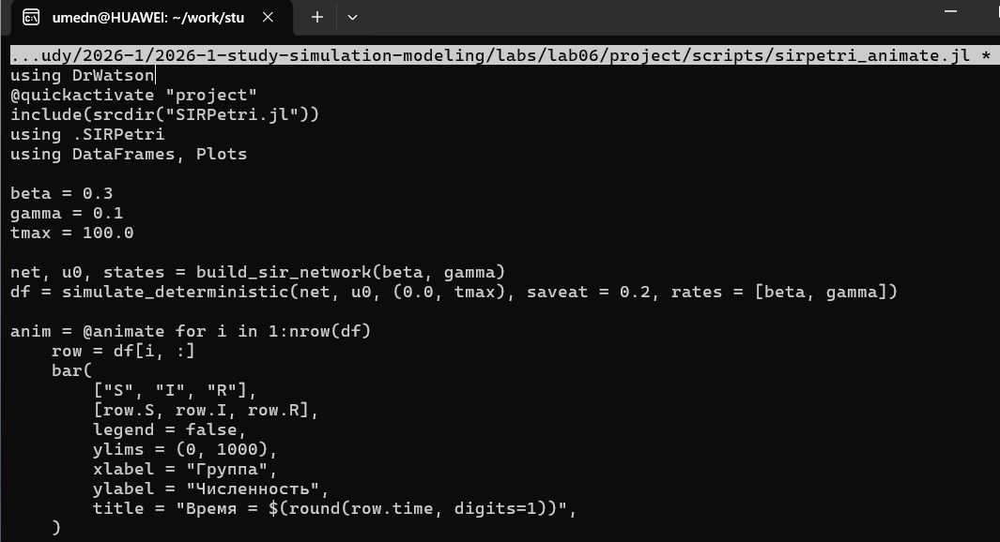{width=80%}

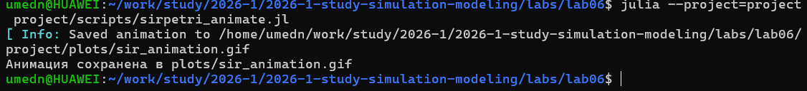{width=80%}

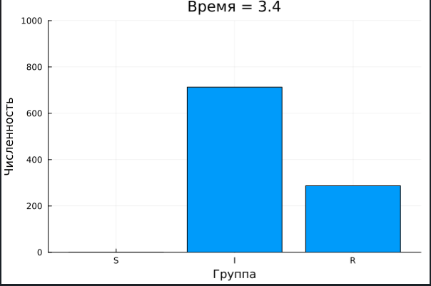{width=80%}

Анимация наглядно показывает волну эпидемии: на первых кадрах преобладает группа восприимчивых, затем растёт число инфицированных до пика, после чего оно снижается, а численность выздоровевших продолжает расти.

## Итоговый сравнительный отчёт

Для сводного анализа результатов создан файл scripts/sirpetri_report.jl, загружающий ранее сохранённые CSV-файлы и строящий два сравнительных графика.

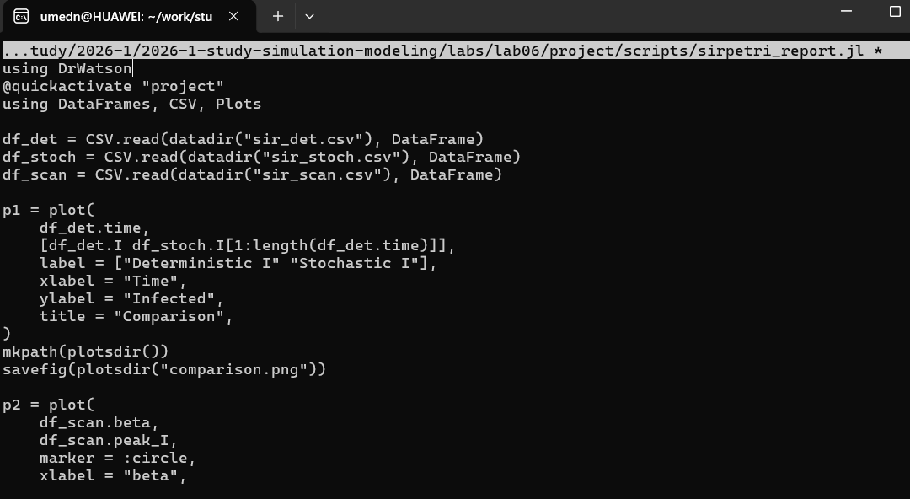{width=80%}

{width=80%}

{width=80%}

Сравнение детерминированной и стохастической кривых I(t) показывает, что при большом размере популяции они близки, а график чувствительности количественно демонстрирует, как рост заразности beta влияет на тяжесть эпидемии.

## Генерация производных форматов

Для преобразования всех четырёх скриптов в литературный стиль использован вспомогательный скрипт tangle.jl на основе библиотеки Literate.jl. Для каждого скрипта сгенерированы чистый исполняемый код, документация в формате Quarto и Jupyter Notebook, который затем был выполнен.

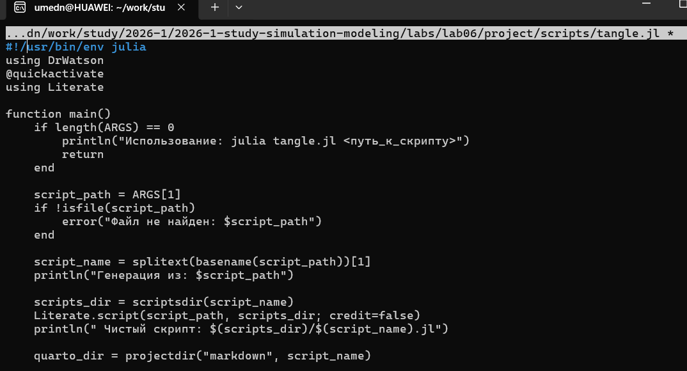{width=80%}

# Выводы

В ходе лабораторной работы реализована модель SIR в формализме сетей Петри с двумя подходами к моделированию — детерминированным на основе ОДУ и стохастическим на основе алгоритма Гиллеспи. Проведённое сканирование параметра заразности подтвердило наличие порогового явления, характерного для эпидемиологических моделей: существует критическое значение beta, ниже которого эпидемия не развивается, а выше — быстро охватывает практически всю популяцию. Построенные анимация и сравнительные графики наглядно продемонстрировали динамику эпидемии и близость детерминированной и стохастической траекторий при большой численности популяции. Весь код преобразован в литературный стиль с генерацией нескольких производных форматов.

# Список литературы{.unnumbered}

::: {#refs}
::: sirp