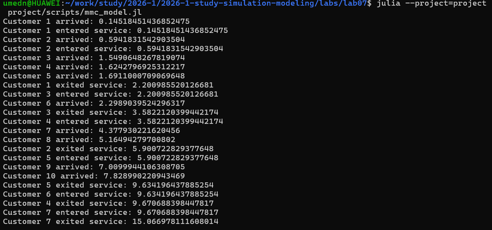
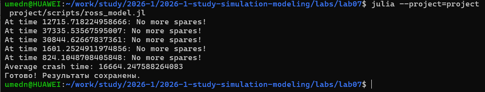

---
## Author
author:
  name: Назармамадов Умед Джамшедович
  email: 1032225205@rudn.ru
  affiliation:
    - name: Российский университет дружбы народов
      country: Российская Федерация
      postal-code: 117198
      city: Москва
      address: ул. Миклухо-Маклая, д. 6

## Title
title: "Лабораторная работа №7"
subtitle: "Дискретно-событийное моделирование: модели M/M/c и Росса"
license: "CC BY"
---

## Цель работы

- Изучить дискретно-событийный подход к моделированию (DES)
- Реализовать модель массового обслуживания M/M/c
- Реализовать модель Росса (резерв и ремонт)
- Использовать библиотеку ConcurrentSim.jl

## Дискретно-событийное моделирование

- Состояние системы меняется только в моменты событий
- Модельное время продвигается скачками
- Процесс — возобновляемая функция (@resumable)
- @yield timeout / @yield request приостанавливают процесс

## Модель M/M/c

- M — пуассоновский входящий поток заявок
- M — экспоненциальное время обслуживания
- c — число параллельных каналов обслуживания
- Загрузка системы rho = lambda/(c*mu)

## Реализация M/M/c

- 2 канала обслуживания
- Интенсивность обслуживания mu=0.5
- Интенсивность поступления lambda=0.9
- Каждый клиент — отдельный процесс

## Результаты M/M/c

{width=60%}

Время ожидания каждого клиента в очереди.

## Модель Росса

- N=10 рабочих машин, S=3 резервных
- Наработка на отказ ~ exp(100 часов)
- Время ремонта ~ exp(1 час)
- Один ремонтник, обслуживает одну машину

## Логика модели Росса

- Машина ломается — забирает резервную
- Сломанная машина отправляется в ремонт
- Если резерва нет — система падает (crash)
- После ремонта машина пополняет резерв

## Результаты модели Росса

{width=60%}

Время до падения системы по нескольким прогонам.

## Интерпретация

- Интенсивность отказов существенно выше интенсивности ремонта
- При малом резерве система быстро исчерпывает запас
- Увеличение S значительно увеличивает время до падения
- Демонстрирует важность резервирования

## Литературное программирование

- Скрипты преобразованы через Literate.jl
- Сгенерированы: чистый код, Quarto-документация, Jupyter Notebook
- Notebooks выполнены и проверены

## Выводы

- Реализованы две классические DES-модели массового обслуживания
- M/M/c продемонстрировала работу многоканальной системы
- Модель Росса показала значимость уровня резервирования
- Библиотека ConcurrentSim.jl удобна для DES на Julia

