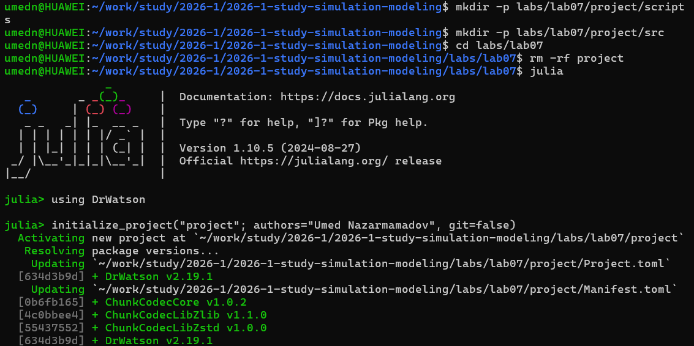
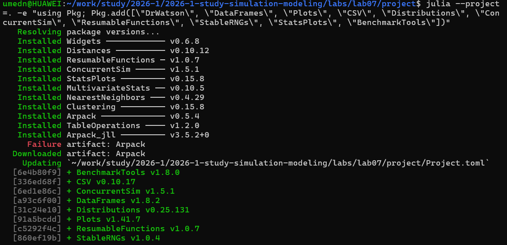
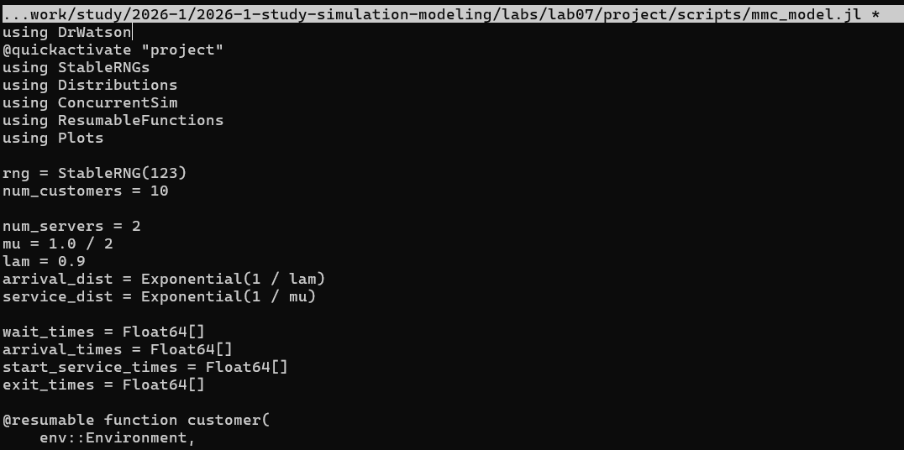
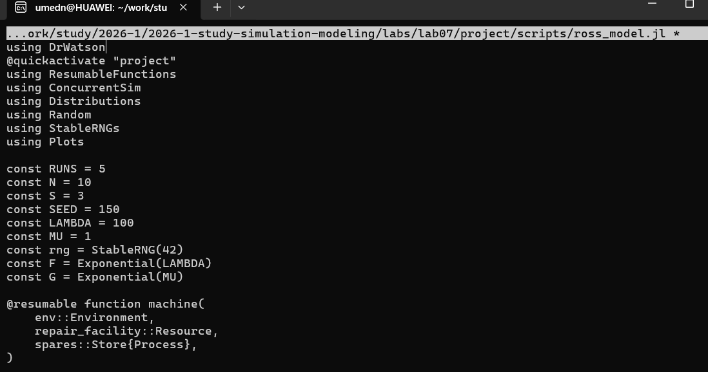
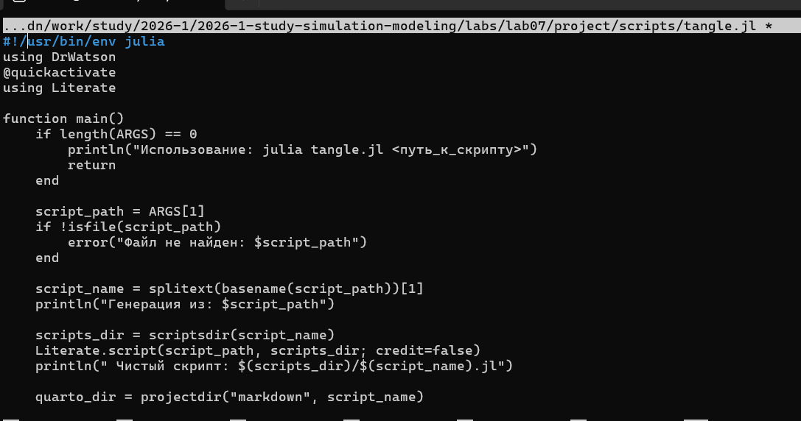
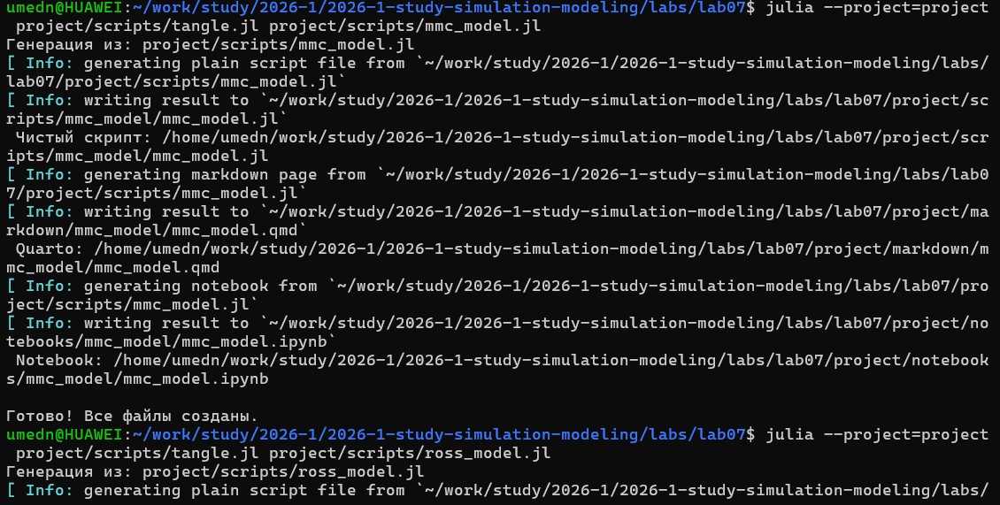

---
## Author
author:
  name: Назармамадов Умед Джамшедович
  email: 1032225205@rudn.ru
  affiliation:
    - name: Российский университет дружбы народов
      country: Российская Федерация
      postal-code: 117198
      city: Москва
      address: ул. Миклухо-Маклая, д. 6

## Title
title: "Лабораторная работа №7"
subtitle: "Дискретно-событийное моделирование: модели M/M/c и Росса"
license: "CC BY"
---

# Цель работы

Целью данной лабораторной работы является изучение дискретно-событийного подхода к имитационному моделированию и реализация двух классических моделей систем массового обслуживания: модели M/M/c и модели Росса (система с резервированием и ремонтом).

# Задание

1. Создать рабочий каталог для кода и установить необходимые пакеты.
2. Реализовать модель массового обслуживания M/M/c с использованием библиотеки ConcurrentSim.jl.
3. Реализовать модель Росса — систему с конечной популяцией машин, резервом и ремонтом.
4. Построить необходимые графики по результатам моделирования.
5. Преобразовать код в литературный стиль и сгенерировать чистый код, документацию Quarto и Jupyter Notebook.
6. Выполнить код из Jupyter Notebook.

# Теоретическое введение

Дискретно-событийное моделирование (Discrete-Event Simulation, DES) — это подход к компьютерному моделированию, при котором состояние системы изменяется только в определённые моменты времени, называемые событиями. Между событиями состояние системы считается постоянным. Модельное время продвигается скачками от одного события к следующему, а не непрерывно. В библиотеке ConcurrentSim.jl процесс реализуется как возобновляемая функция (@resumable), которая может приостанавливаться (например, ожидая истечения времени через timeout или захвата ресурса через request) и возобновляться, когда соответствующее условие выполняется.

Модель M/M/c (по классификации Кендалла) описывает систему массового обслуживания с пуассоновским входящим потоком заявок, экспоненциальным временем обслуживания и c параллельными идентичными каналами обслуживания. Ключевым параметром является загрузка системы rho = lambda/(c*mu), где lambda — интенсивность входящего потока, mu — интенсивность обслуживания одним каналом.

Модель Росса — классический пример системы массового обслуживания с конечной популяцией, резервированием и одним ремонтным устройством. В системе имеется N постоянно работающих машин и S резервных. Когда рабочая машина ломается, она немедленно заменяется резервной (если та есть), а сломанная отправляется в ремонт. Если резерва нет, система "падает" (crash). Требуется оценить среднее время до падения системы E[T] при заданных распределениях наработки на отказ и времени ремонта.

# Выполнение лабораторной работы

## Подготовка окружения

Для реализации моделей был установлен язык Julia и необходимые пакеты: ConcurrentSim (ядро дискретно-событийного моделирования), ResumableFunctions (возобновляемые функции-процессы), Distributions, StableRNGs, DataFrames, Plots и DrWatson.

{width=80%}

{width=80%}

## Модель M/M/c

Модель реализована в файле scripts/mmc_model.jl. Система имеет 2 канала обслуживания (num_servers=2), интенсивность обслуживания mu=0.5 и интенсивность поступления заявок lambda=0.9. Каждый клиент моделируется как отдельный процесс: он ожидает время до прибытия, затем запрашивает свободный сервер (ресурс), обслуживается случайное экспоненциальное время и покидает систему.

{width=80%}

{width=80%}

По результатам моделирования построен график времени ожидания каждого клиента в очереди, позволяющий оценить загруженность системы и её способность справляться с потоком заявок при заданных параметрах.

## Модель Росса

Модель реализована в файле scripts/ross_model.jl. Рассмотрена система с N=10 рабочими машинами и S=3 резервными, со средним временем безотказной работы одной машины 100 часов и средним временем ремонта 1 час. Каждая машина моделируется как отдельный процесс: работающая машина после случайного времени наработки ломается, забирает резервную машину (если она есть) и отправляется на ремонт; ремонтник

ет только одну машину одновременно. Если в момент отказа резерва нет, система падает и симуляция завершается. Эксперимент повторён 5 раз для получения усреднённой оценки среднего времени до падения системы.

{width=80%}

{width=80%}

Результаты показывают, что при данных параметрах (интенсивность отказов существенно выше интенсивности ремонта при малом начальном резерве) система относительно быстро исчерпывает резерв и падает, что иллюстрирует важность правильного выбора уровня резервирования в реальных технических системах.

## Генерация производных форматов

Для преобразования обоих скриптов в литературный стиль использован вспомогательный скрипт tangle.jl на основе библиотеки Literate.jl. Для каждого скрипта сгенерированы чистый исполняемый код, документация в формате Quarto и Jupyter Notebook, который затем был выполнен.

{width=80%}

{width=80%}

# Выводы

В ходе лабораторной работы изучен дискретно-событийный подход к имитационному моделированию с использованием библиотеки ConcurrentSim.jl на языке Julia. Реализованы две классические модели систем массового обслуживания: модель M/M/c, демонстрирующая работу многоканальной системы обслуживания с пуассоновским потоком заявок, и модель Росса, иллюстрирующая систему с конечной популяцией, резервированием и ремонтом, а также значимость выбора уровня резервирования для повышения надёжности системы. Весь код преобразован в литературный стиль с генерацией нескольких производных форматов.

# Список литературы{.unnumbered}

::: {#refs}
::: обслужива