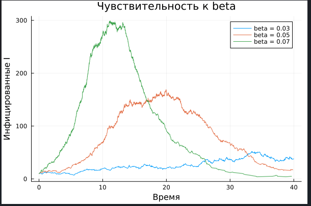
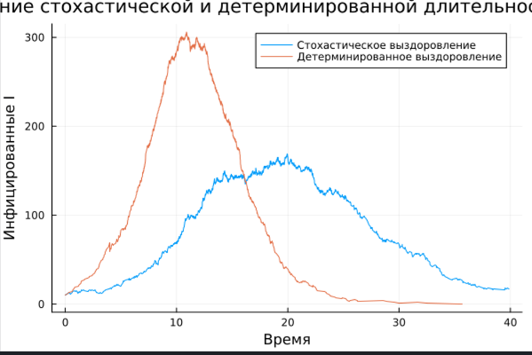

---
## Author
author:
  name: Назармамадов Умед Джамшедович
  email: 1032225205@rudn.ru
  affiliation:
    - name: Российский университет дружбы народов
      country: Российская Федерация
      postal-code: 117198
      city: Москва
      address: ул. Миклухо-Маклая, д. 6

## Title
title: "Лабораторная работа №8"
subtitle: "Реализация модели SIR в дискретно-событийном подходе"
license: CC BY
date: today
date-format: 2026-09-02
---

# Информация

## Докладчик

:::::::::::::: {.columns align=center}
::: {.column width="70%"}

  * Назармамадов Умед Джамшедович
  * Российский университет дружбы народов им. П. Лумумбы
  * [1032225205@rudn.ru]
  * <https://umednazarmamadov.github.io/ru/>

:::
::: {.column width="30%"}

:::
::::::::::::::

# Вводная часть

## Цель работы

- Реализовать дискретно-событийную модель SIR на уровне индивидов
- Провести анализ чувствительности к параметру beta
- Сравнить стохастическую и детерминированную длительность болезни

## Дискретно-событийная модель SIR

- Каждый индивид — отдельный процесс
- Полностью смешивающаяся популяция
- Восприимчивый выбирает случайного собеседника
- Заражение с вероятностью beta при контакте с инфицированным

## Реализация модели

- SIRPerson: id, статус (:S/:I/:R)
- live(): жизненный цикл индивида
- Контакты с интенсивностью c
- Выздоровление через exp(1/gamma)

## Базовый запуск

Параметры: S=990, I=10, R=0, beta=0.05, c=10, gamma=0.25

{width=60%}

Классическая динамика эпидемии с характерным стохастическим шумом.

## Анализ чувствительности к beta

{width=60%}

beta = 0.03, 0.05, 0.07 — рост заразности усиливает и ускоряет пик эпидемии.

## Стохастика vs детерминизм

{width=60%}

Детерминированная длительность болезни — более синхронное и резкое выздоровление.

## Интерпретация результатов

- Рост beta увеличивает пик и итоговую долю переболевших
- Случайность длительности болезни сглаживает и растягивает эпидемию
- Дискретно-событийный подход учитывает индивидуальные флуктуации

## Литературное программирование

- Все скрипты преобразованы через Literate.jl
- Сгенерированы: чистый код, Quarto-документация, Jupyter Notebook
- Notebooks выполнены и проверены

## Итоги курса

- 8 лабораторных работ по имитационному моделированию
- ОДУ, агентное моделирование, сети Петри, дискретные события
- Полный цикл: код → литературный стиль → отчёт → презентация
- Все результаты опубликованы на GitHub через git-flow

## Выводы

- Дискретно-событийная модель SIR успешно реализована
- Подтверждено влияние заразности на динамику эпидемии
- Показана роль случайности длительности болезни
- Курс лабораторных работ по имитационному моделированию завершён

