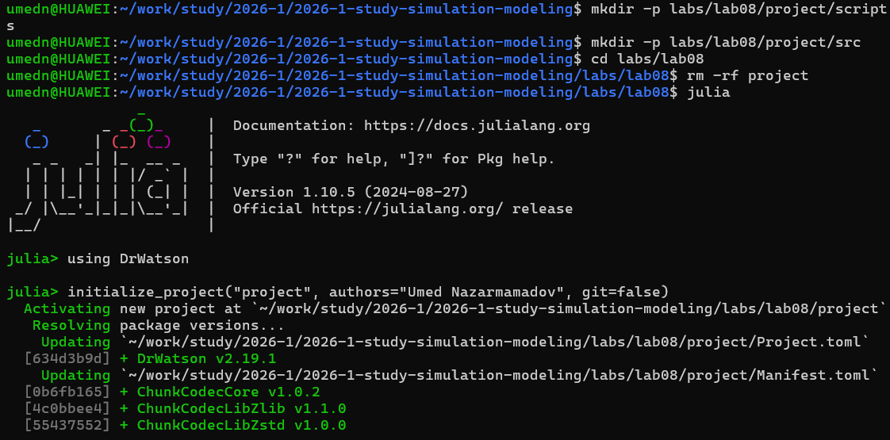
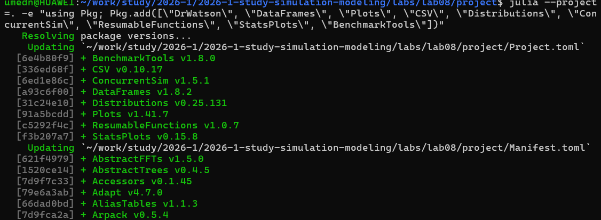
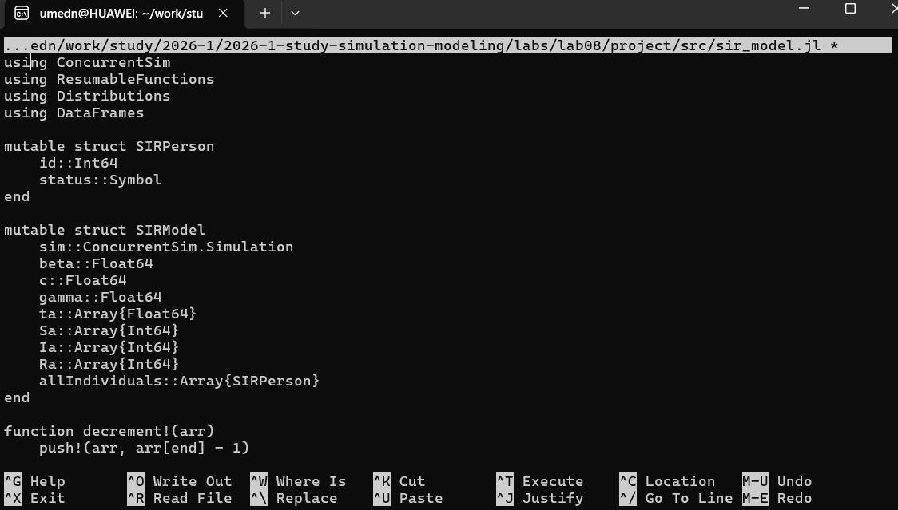
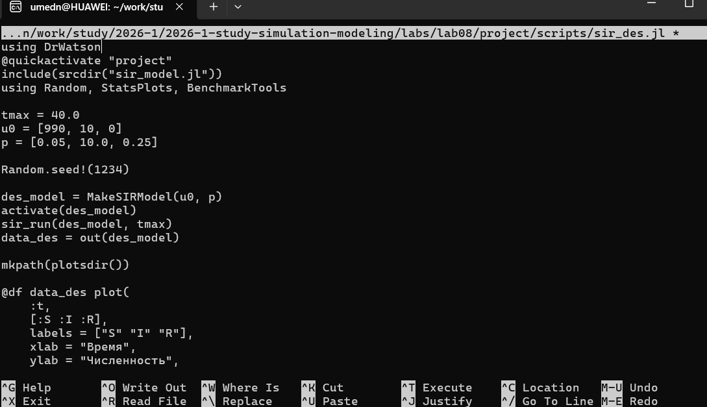
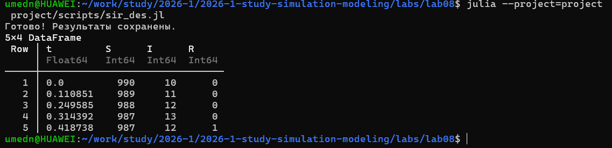
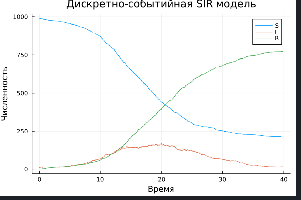
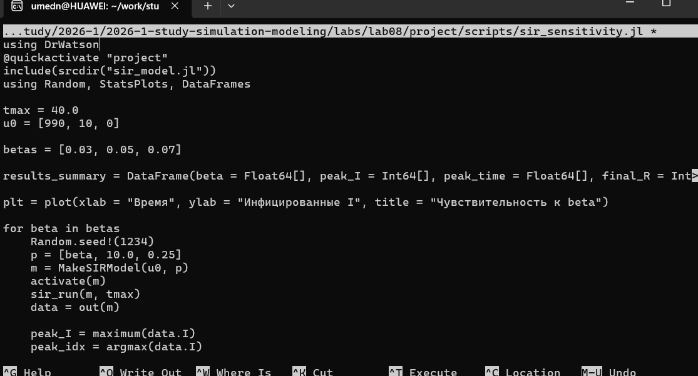
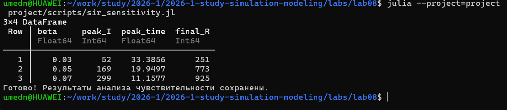
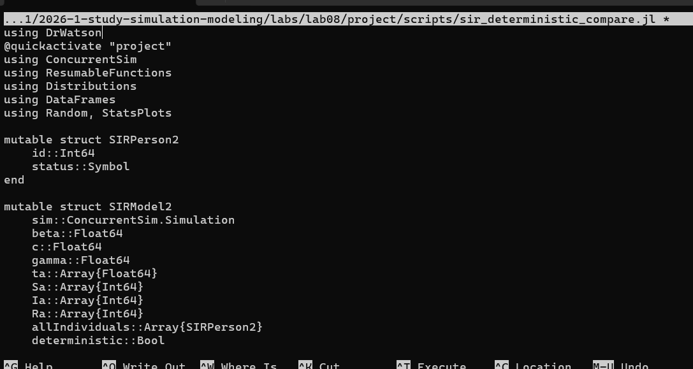
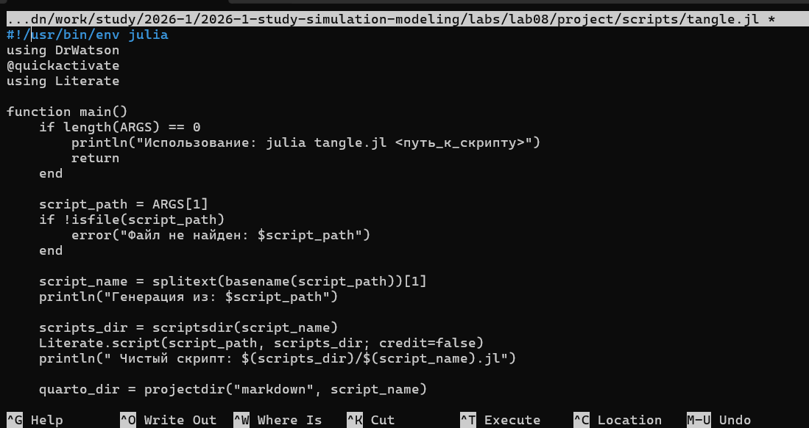

---
## Author
author:
  name: Назармамадов Умед Джамшедович
  email: 1032225205@rudn.ru
  affiliation:
    - name: Российский университет дружбы народов
      country: Российская Федерация
      postal-code: 117198
      city: Москва
      address: ул. Миклухо-Маклая, д. 6

## Title
title: "Лабораторная работа №8"
subtitle: "Реализация модели SIR в дискретно-событийном подходе"
license: "CC BY"
---

# Цель работы

Целью данной лабораторной работы является реализация классической эпидемиологической модели SIR в дискретно-событийном подходе на уровне отдельных индивидов, а также исследование чувствительности модели к параметрам и сравнение стохастической и детерминированной версий длительности болезни.

# Задание

1. Создать рабочий каталог для кода и установить необходимые пакеты.
2. Реализовать дискретно-событийную модель SIR на уровне отдельных индивидов с использованием библиотеки ConcurrentSim.jl.
3. Провести анализ чувствительности модели к параметру заразности beta.
4. Сравнить стохастическую и детерминированную длительность болезни.
5. Преобразовать код в литературный стиль и сгенерировать чистый код, документацию Quarto и Jupyter Notebook.
6. Выполнить код из Jupyter Notebook.

# Теоретическое введение

В отличие от популяционной модели SIR (система ОДУ) и агентной модели на графе городов, дискретно-событийная реализация моделирует каждого индивида как независимый процесс в полностью смешивающейся популяции конечного размера. Каждый восприимчивый индивид периодически (с интенсивностью c) выбирает случайного собеседника из популяции; если тот инфицирован, заражение происходит с вероятностью beta. Заразившийся индивид остаётся инфекционным случайное экспоненциальное время со средним 1/gamma, после чего выздоравливает. Такой подход позволяет учесть случайные флуктуации и возможность раннего затухания эпидемии при малом начальном числе инфицированных, которые невозможно уловить в детерминированной модели ОДУ.

# Выполнение лабораторной работы

## Подготовка окружения

Для реализации модели был установлен язык Julia и необходимые пакеты: ConcurrentSim, ResumableFunctions, Distributions, StatsPlots, BenchmarkTools, DataFrames и DrWatson.

{width=80%}

{width=80%}

## Реализация модели

Модель реализована в модуле src/sir_model.jl. Каждый индивид представлен структурой SIRPerson с идентификатором и статусом (:S, :I или :R). Функция live реализует жизненный цикл индивида: восприимчивый индивид периодически контактирует со случайным членом популяции и заражается с вероятностью beta, если контакт инфицирован; инфицированный индивид через экспоненциальное время выздоравливает. При каждом изменении статуса обновляется статистика модели (массивы времени события и численности каждой группы).

{width=80%}

## Базовый запуск модели

Для запуска базовой модели создан файл scripts/sir_des.jl. Начальные условия: S=990, I=10, R=0, параметры beta=0.05, c=10.0, gamma=0.25, длительность симуляции 40 единиц модельного времени.

{width=80%}

{width=80%}

{width=80%}

Результаты демонстрируют классическую динамику эпидемии на уровне отдельных индивидов: быстрый рост числа инфицированных до пика с последующим спадом по мере перехода индивидов в группу выздоровевших, при этом график содержит характерную стохастическую "шероховатость", отсутствующую в детерминированной ОДУ-модели.

## Анализ чувствительности к параметрам

Для исследования влияния коэффициента заразности beta на динамику эпидемии создан файл scripts/sir_sensitivity.jl. Проведены прогоны модели с одним и тем же зерном генератора случайных чисел для трёх значений beta (0.03, 0.05, 0.07), для каждого прогона зафиксированы пиковое число инфицированных, время достижения пика и итоговая доля переболевших.

{width=80%}

{width=80%}

{width=80%}

Результаты показывают

что увеличение коэффициента заразности приводит к более раннему и более высокому пику эпидемии, а также к большей итоговой доле переболевших, что согласуется с теоретическими предсказаниями популяционных моделей SIR.

## Сравнение стохастической и детерминированной длительности болезни

Для оценки влияния случайности длительности болезни на динамику эпидемии создан файл scripts/sir_deterministic_compare.jl. В нём реализована модификация модели, в которой время выздоровления либо разыгрывается из экспоненциального распределения (стохастический вариант), либо всегда равно фиксированной величине 1/gamma (детерминированный вариант). Оба варианта запущены с одинаковым зерном генератора случайных чисел.

{width=80%}

{width=80%}

Сравнение показывает, что при детерминированной длительности болезни выздоровление индивидов происходит более синхронно (отсутствуют "хвосты" экспоненциального распределения), что приводит к более резкому и более выраженному пику, а также несколько более быстрому завершению эпидемии по сравнению со стохастическим вариантом.

## Генерация производных форматов

Для преобразования всех трёх скриптов в литературный стиль использован вспомогательный скрипт tangle.jl на основе библиотеки Literate.jl. Для каждого скрипта сгенерированы чистый исполняемый код, документация в формате Quarto и Jupyter Notebook, который затем был выполнен.

{width=80%}

# Выводы

В ходе лабораторной работы реализована дискретно-событийная модель SIR на уровне отдельных индивидов с использованием библиотеки ConcurrentSim.jl. Проведённый анализ чувствительности подтвердил, что увеличение заразности beta усиливает и ускоряет эпидемию, а сравнение стохастической и детерминированной длительности болезни показало, что случайность времени выздоровления сглаживает пик эпидемии и растягивает её во времени по сравнению с фиксированной длительностью. Весь код преобразован в литературный стиль с генерацией нескольких производных форматов.

# Список литературы{.unnumbered}

::: {#refs}
:::,